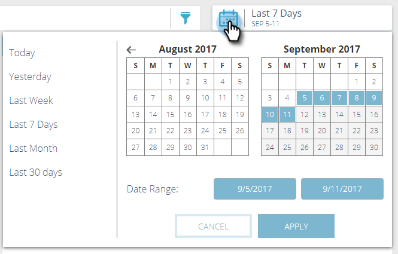

# Présentation des analyses de contenu prédictif {#predictive-content-analytics-overview}

Utilisez l’analyse de contenu pour mieux comprendre votre contenu existant, découvrir (en fonction des algorithmes d’IA et de prédiction) quel contenu fonctionne pour vos audiences et augmenter le retour sur investissement de vos efforts marketing.

>[!NOTE]
>
>L’onglet Analyses et les fonctionnalités d’analyse de contenu sont disponibles exclusivement avec le contenu prédictif Marketing.

## Présentation {#overview}

Dans la page Résumé, cliquez sur Analytics.

Analytics comprend plusieurs sections : Contenu principal par Vue, Contenu principal par Taux de conversion, Contenu tendance, Contenu suggéré et Contenu proposé.

Passez la souris sur le point d’interrogation d’un en-tête de section pour obtenir des détails supplémentaires.

Cliquez sur le bouton Exporter pour exporter les résultats de cette section via Excel.

Vous pouvez filtrer les résultats selon divers attributs/propriétés (par exemple, Liste de compte ABM, Pays, etc.).

Cliquez sur l’icône de calendrier pour modifier les dates des données reflétées. Choisissez une durée prédéfinie ou une plage de dates spécifique.

## Contenu principal par Vue {#top-content-by-views}

Affiche les principales parties de contenu par nombre de vues pour la période sélectionnée.

## Contenu principal par Taux de conversion {#top-content-by-conversion-rate}

Affiche le contenu présentant le plus fort taux de conversion par taux de conversion pour la période sélectionnée.

>[!NOTE]
>
>**Définition**
>
>**taux de conversion**: Pourcentage calculé par conversions directes divisé par les clics.

## Contenu de tendance {#trending-content}

Affiche l&#39;augmentation de popularité d&#39;une partie du contenu en observant la dernière augmentation de vues de deux semaines par rapport à la même période précédente.

## Contenu suggéré {#suggested-content}

Affiche le contenu que nous vous suggérons de promouvoir dans vos Activités marketing en fonction du filtre que vous avez défini.

Passez la souris sur une image dans Contenu proposé pour afficher les options disponibles.

>[!NOTE]
>
>**Explication**
>
>Vous voyez ces icônes en bas ? De gauche à droite, ils sont : Contenu de la vue, Exporter au format CSV, Approuver le contenu.

## Contenu {#content}

Recherchez l’élément de contenu souhaité et cliquez dessus pour afficher d’autres détails, notamment : les visiteurs qui l&#39;ont regardé, les nouveaux contre les nouveaux venus, connus et anonymes, les principaux endroits d&#39;où les visiteurs venaient en regardant le contenu, et les principales industries dont ils sont issus.

>[!NOTE]
>
>Le contenu similaire est basé sur l’élément de contenu sélectionné et est calculé par un algorithme de règles d’association. Les résultats représentent des éléments de contenu sur lesquels les visiteurs cliqueront le plus probablement, en fonction de l’élément sélectionné et du comportement passé du visiteur. Il ne prend pas en compte le filtre ou la plage de dates.

