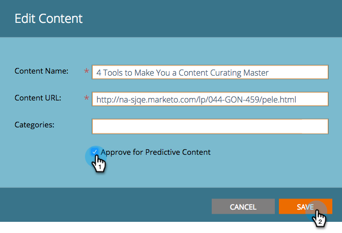

# Approbation d’un titre pour le contenu prédictif {#approve-a-title-for-predictive-content}

>[!NOTE]
>
>Selon la date d’achat, votre abonnement Marketo peut inclure du contenu prédictif ou du contenu`AI`. Pour les utilisateurs de contenu prédictif, Marketo active les fonctionnalités d’analyse de contenu`AI` jusqu’au 30 avril 2018. Pour conserver ces fonctionnalités au-delà de cette date, contactez votre responsable de succès client Marketing Cloud pour effectuer la mise à niveau vers le contenu`AI`Marketo.

Vous pouvez ajouter n’importe quel titre de votre page Tout le contenu au contenu prédictif en l’approuvant sur la page Tout le contenu ou dans la fenêtre contextuelle Modifier le contenu.

## Toute la page de contenu {#all-content-page}

1. Cochez la case en regard de l’élément de contenu.

   

1. Cliquez sur la liste déroulante Actions **de** contenu et sélectionnez **Approuver pour le contenu** prédictif.

   

## Menu contextuel Modifier le contenu {#edit-content-pop-up}

Vous pouvez également approuver les titres pour le contenu prédictif directement dans la fenêtre contextuelle Modifier le contenu.

1. Passez la souris sur un élément de contenu et cliquez sur l’icône Modifier située à la fin de la ligne.

   

1. Cochez la case **Approuver pour le contenu** prédictif dans la fenêtre contextuelle Modifier le contenu, puis cliquez sur **Enregistrer**.

   

Quelle que soit votre utilisation, l’icône Approuver pour le contenu prédictif s’affiche désormais dans la ligne.

Vous pouvez maintenant voir le titre affiché sur la page Contenu prédictif.

