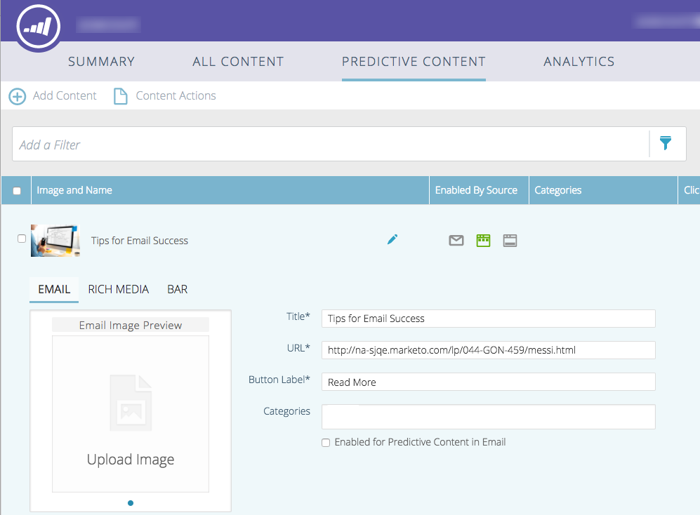

# Modifier le contenu prédictif pour les courriels {#edit-predictive-content-for-emails}

>[!NOTE]
>
>Selon la date d’achat, votre abonnement Marketo peut inclure du contenu prédictif ou du contenu`AI`. Pour les utilisateurs de contenu prédictif, Marketo active les fonctionnalités d’analyse de contenu`AI` jusqu’au 30 avril 2018. Pour conserver ces fonctionnalités au-delà de cette date, contactez votre responsable de succès client Marketing Cloud pour effectuer la mise à niveau vers le contenu`AI`Marketo.

Voici comment configurer votre contenu prédictif pour les courriels.

>[!PREREQUISITES]
>
>Le contenu doit être [approuvé pour le contenu](/help/marketo/product-docs/predictive-content/working-with-all-content/approve-a-title-for-predictive-content.md) prédictif sur la page Tout le contenu.

1. Dans la page Contenu prédictif, cliquez sur un titre pour ouvrir l’éditeur.

   

1. La page de modification s’ouvre. **Le courrier électronique** s’affiche par défaut.

   

   >[!NOTE]
   >
   >Le titre et l’URL sont déjà renseignés. Vérifiez qu&#39;ils sont ce que vous voulez.

1. Pour ajouter/modifier le libellé du bouton, tapez le texte dans la zone de texte à droite.

   

   >[!NOTE]
   >
   >Si vous avez modifié l’étiquette du bouton, celle-ci sera mise à jour lorsque vous enregistrerez vos modifications ou prévisualisations d’image.

1. Pour ajouter ou modifier l’URL de l’image, cliquez sur **Modifier l’image**.

   

1. Insérez l’URL de l’image, puis cliquez sur **Ajouter**.

   

1. Cliquez et faites glisser le curseur pour modifier la taille de l’image. Cliquez ensuite sur la zone de recadrage et faites-la glisser pour isoler la zone d’image à utiliser. Cliquez sur **Prévisualisation** lorsque vous avez terminé.

   

1. Cliquez sur les flèches sur les côtés pour faire défiler et vue votre contenu dans chacune des prévisualisations de mise en page du courrier électronique (deux options s’affichent).

   |  |  |
   |---|---|

1. Si vous le souhaitez, cliquez sur le champ **Catégories** et ajoutez des catégories au contenu. Les options proviennent des [catégories que vous avez déjà configurées](/help/marketo/product-docs/predictive-content/getting-started/set-up-categories.md).

   

1. Cochez la case pour activer le contenu prédictif dans le courrier électronique.

   

1. Cliquez sur **Enregistrer**.

   

   >[!NOTE]
   >
   >Dans la version 2.0 de l’éditeur de courriel de marketing, vous pouvez également [vue les modèles](/help/marketo/product-docs/predictive-content/enabling-predictive-content/enable-predictive-content-in-emails.md) de mise en page que vous utilisez lorsque vous activez le contenu.
