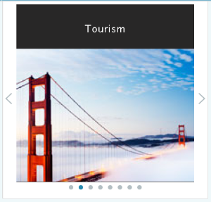

# Modifier le contenu prédictif des e-mails {#edit-predictive-content-for-emails}

Voici comment configurer votre contenu prédictif pour les e-mails.

>[!PREREQUISITES]
>
>Le contenu doit être [approuvé pour le contenu prédictif](/help/marketo/product-docs/predictive-content/working-with-all-content/approve-a-title-for-predictive-content.md) sur la page [!UICONTROL Tout le contenu].

1. Sur la page [!UICONTROL Contenu prédictif], cliquez sur un titre pour ouvrir l’éditeur.

   

1. La page de modification s’ouvre. **[!UICONTROL E-mail]** s’affiche par défaut.

   

   >[!NOTE]
   >
   >Le titre et l’URL sont déjà renseignés. Vérifiez qu&#39;ils sont ce que vous voulez.

1. Pour ajouter/modifier le libellé du bouton, saisissez dans la zone de texte située à droite.

   

   >[!NOTE]
   >
   >Si vous avez modifié le libellé du bouton, il sera mis à jour lorsque vous enregistrerez vos modifications ou prévisualiserez votre image.

1. Pour ajouter ou modifier l’URL de l’image, cliquez sur **[!UICONTROL Modifier l’image]**.

   

   >[!CAUTION]
   >
   >Pour garantir une qualité optimale, votre image doit faire au moins 400 x 400 pixels.

1. Insérez l’URL de l’image et cliquez sur **[!UICONTROL Ajouter]**.

   

1. Cliquez sur le curseur et faites-le glisser pour modifier la taille de l’image. Cliquez ensuite sur la zone de recadrage et faites-la glisser pour isoler la zone d’image souhaitée. Cliquez sur **[!UICONTROL Aperçu]** lorsque vous avez terminé.

   

1. Cliquez sur les flèches sur les côtés pour faire défiler l’écran et afficher votre contenu dans chacun des aperçus de disposition d’e-mail (deux options s’affichent).

   |  |  |
   |---|---|

1. Si vous le souhaitez, cliquez sur le champ **[!UICONTROL Catégories]** et ajoutez des catégories au contenu. Les options sont issues des [catégories que vous avez déjà configurées](/help/marketo/product-docs/predictive-content/getting-started/set-up-categories.md).

   

1. Cochez la case pour activer le contenu prédictif dans l’e-mail.

   

1. Cliquez sur **[!UICONTROL Enregistrer]**

   

   >[!NOTE]
   >
   >Dans Marketo Email Editor v2.0, vous pouvez également [afficher les modèles de disposition](/help/marketo/product-docs/predictive-content/enabling-predictive-content/enable-predictive-content-in-emails.md) que vous utilisez lors de l’activation du contenu.
