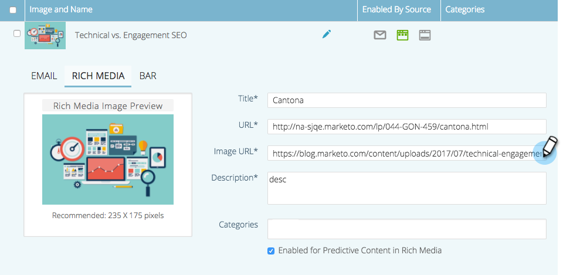

# Modification de contenu prédictif pour les médias riches {#edit-predictive-content-for-rich-media}

Voici comment configurer votre contenu prédictif pour les médias riches.

>[!PREREQUISITES]
>
>Le contenu doit être [approuvé pour le contenu prédictif](/help/marketo/product-docs/predictive-content/working-with-all-content/approve-a-title-for-predictive-content.md) sur la page [!UICONTROL Tout le contenu].

1. Sur la page **[!UICONTROL Contenu prédictif]**, cliquez sur un titre pour ouvrir l’éditeur.

   

1. Cliquez sur **[!UICONTROL Média enrichi]**.

   

1. Vous remarquerez que vous pouvez avoir des images distinctes pour les e-mails et les médias riches. Pour ajouter/modifier l’image, collez l’URL de l’image dans sa zone de texte.

   

   >[!NOTE]
   >
   >Les images JPEG avec le modèle de couleur CMJN ne sont pas prises en charge pour les médias riches. Les JPEG doivent être convertis en sRGB à l’aide d’un profil de couleurs. Veillez à choisir ce paramètre lors de l’exportation à partir de votre éditeur d’images.

1. Saisissez une **Description**.

   

1. Cliquez sur la zone **[!UICONTROL Catégories]** pour sélectionner/ajouter des [catégories que vous avez déjà configurées](/help/marketo/product-docs/predictive-content/getting-started/set-up-categories.md) (facultatif).

   

   >[!NOTE]
   >
   >Utilisez des catégories pour regrouper le contenu pour un modèle de recommandation spécifique de contenu multimédia enrichi. Laissez la catégorie vide pour appliquer le contenu à tous les modèles de recommandation (recommandé).
   >
   >Cependant, si vous souhaitez recommander uniquement du contenu spécifique pour un modèle de média enrichi, ajoutez une catégorie pour le contenu et associez cette catégorie au modèle de recommandation.
   >
   >Par exemple, catégorisez le contenu pertinent en fonction des sections de votre site web (produits ou solutions).

1. Cochez la case pour activer le contenu prédictif dans les médias riches.

   

1. Cliquez sur **[!UICONTROL Enregistrer]**.

   
