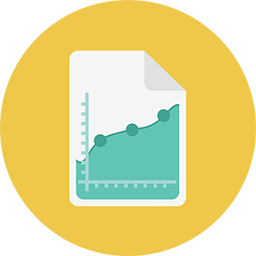

# Rapports {#reporting}

Informations exploitables. C’est ce que les rapports Marketo vous permettent d’obtenir. Vous pouvez même les recevoir directement dans votre boîte de réception.
**Rapports de base** [Rapports de base Commencez à utiliser les principes de base. Rapports sur les e-mails, le web et les personnes, oh mon Dieu ! &#x200B;](https://docs.marketo.com/display/DOCS/Basic+Reporting)     **Revenue Cycle Analytics** [Revenue Cycle Analytics : utilisez l’analyse des données de série temporelle de manière plus hardcore.](https://docs.marketo.com/display/DOCS/Revenue+Cycle+Analytics)     **Informations sur les performances** [Informations sur les performances Affichez tous les KPI de performances de votre campagne en un seul endroit.](https://docs.marketo.com/display/DOCS/Marketing+Performance+Insights)     **Informations sur les e-mails** [Informations sur les e-mails Explorez des informations puissantes à l’aide de vos données historiques.](https://docs.marketo.com/display/DOCS/Email+Insights)
