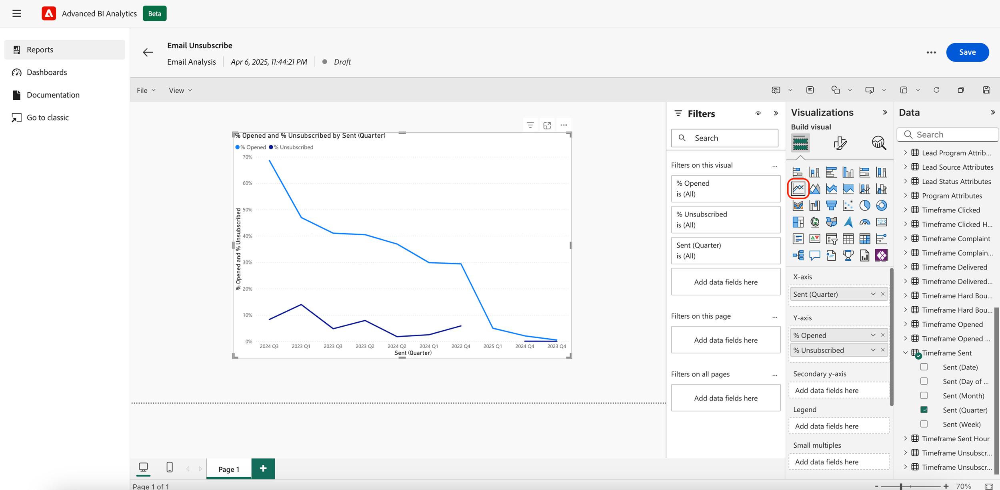

# Présentation d’Advanced BI Analytics {#advanced-bi-analytics-overview}

Advanced BI Analytics (anciennement connu sous le nom de Revenue Explorer et Advanced Report Builder) offre une interface de création de rapports et de visualisation flexible sur les données Marketo Engage, fournissant des détails granulaires sur la progression, les performances, etc. Il offre une interactivité et une visualisation plus riches, des performances plus rapides et une expérience utilisateur plus fluide et intuitive.

Ces améliorations vous permettent de gagner du temps, de découvrir des informations plus précieuses, de stimuler l’optimisation et de partager des histoires de données plus attrayantes avec des collègues et des parties prenantes.

>[!PREREQUISITES]
>
>Pour accéder à cette fonctionnalité, vous devez avoir acheté le module complémentaire BI Analytics avancé. Pour plus d’informations, contactez l’équipe du compte Adobe (votre gestionnaire de compte).

>[!NOTE]
>
>Si vous avez des questions sur cette fonctionnalité en version bêta (jusqu’au 1er juin 2025), envoyez un e-mail à : `adobe-marketo-advanced-bi-analytics-public-beta@adobe.com`.

## Fonctionnalités et avantages clés {#key-features-and-benefits}

* **Moteur de requête haute performance** : offre des performances cinq fois plus rapides sur les jeux de données volumineux, ce qui permet un traitement des données plus rapide, un chargement de rapport plus rapide et une expérience d’analyse plus fluide.

* **Visualisation riche et attrayante** : collection vaste et étendue d’options de visualisation intégrées, notamment des graphiques, des cartes et des indicateurs de performance clés, qui rendent les tableaux de bord plus informatifs et plus efficaces et améliorent considérablement la narration des données.

* **Interactivité avancée et filtrage dynamique** : appliquez des segments dynamiques, un filtrage croisé et des filtres interdépendants sur les visuels. Les rapports de plusieurs pages prennent en charge l’exploration avancée vers le bas, l’exploration vers le haut et l’exploration amont, ce qui facilite l’exploration des données.

* **Interface de création de rapports intuitive** : une expérience de pointer-cliquer simplifie la création de rapports, y compris les rapports d’exploration amont de plusieurs pages. L’interface permet aux utilisateurs de concevoir des rapports interactifs complexes sans avoir besoin d’une expertise technique approfondie.

* **Partage facile, y compris l’exportation PowerPoint** : la fonctionnalité de partage intégrée facilite le partage d’informations. Entre autres destinations, les utilisateurs peuvent facilement générer des diapositives PowerPoint prêtes pour la présentation.

## Création d’un rapport {#create-a-report}

1. Dans Mon Marketo, cliquez sur la mosaïque **[!UICONTROL Analytique BI avancée (Beta)]**.

   {width="800" zoomable="yes"}

1. Dans l’onglet **[!UICONTROL Rapports]**, cliquez sur **[!UICONTROL Créer un rapport]**.

   {width="800" zoomable="yes"}

1. Sélectionnez les mesures souhaitées.

   {width="800" zoomable="yes"}

1. Sélectionnez les dimensions souhaitées.

   {width="800" zoomable="yes"}

1. Choisissez votre visualisation préférée.

   {width="800" zoomable="yes"}

1. Ajoutez des filtres en faisant glisser et en déposant un attribut de dimension.

   {width="800" zoomable="yes"}

## Démonstration vidéo {#video}

Regardez la vidéo suivante pour voir un exemple d’expérience de rapport d’exploration amont de plusieurs pages.

>[!VIDEO](https://video.tv.adobe.com/v/3451681/?quality=12&learn=on){transcript=true}

## Rapports standard dans Advanced BI Analytics {#standard-reports}

Les rapports standard suivants sont inclus comme exemples pour vos rapports personnalisés.

<table>
  <thead>
    <tr>
      <th>Zone de reporting</th>
      <th>Nom du rapport</th>
    </tr>
  </thead>
  <tbody>
    <tr>
      <td rowspan="8">Analyse de l'e-mail</td>
      <td>E-mail - Activité Envoyé (au CST)</td>
    </tr>
    <tr>
      <td>E-mail - Activité de clic (au CST)</td>
    </tr>
    <tr>
      <td>E-mail - Activité d’ouverture (au CST)</td>
    </tr>
    <tr>
      <td>E-mail - Répartition du temps de clic (au CST)</td>
    </tr>
    <tr>
      <td>E-mail - Atténuation du taux d’ouverture</td>
    </tr>
    <tr>
      <td>E-mail - Distribution de l’heure d’ouverture (au CST)</td>
    </tr>
    <tr>
      <td>E-mail - Détails sur les performances</td>
    </tr>
    <tr>
      <td>E-mail - Atténuation du taux de clics</td>
    </tr>
    <tr>
      <td rowspan="8">Analyse de lead</td>
      <td>Top 10 Des Sources De Lead Par Prospects Convertis</td>
    </tr>
    <tr>
      <td>Top 10 des sources de leads</td>
    </tr>
    <tr>
      <td>Rapport des violations de SLA</td>
    </tr>
    <tr>
      <td>Rapport sur l'ancienneté des leads</td>
    </tr>
    <tr>
      <td>Rapport du solde des leads</td>
    </tr>
    <tr>
      <td>Rapport de conversion des leads</td>
    </tr>
    <tr>
      <td>Rapport Flux de leads</td>
    </tr>
    <tr>
      <td>Rapport Délai de transition des leads</td>
    </tr>
    <tr>
      <td rowspan="5">Analyse de programme</td>
      <td>Top 10 Des Programmes Par Succès</td>
    </tr>
    <tr>
      <td>10 Meilleurs Programmes Par Pipeline Total</td>
    </tr>
    <tr>
      <td>Rapport d’étape sur le chiffre d’affaires du programme</td>
    </tr>
    <tr>
      <td>Top 10 des programmes d’acquisition</td>
    </tr>
    <tr>
      <td>Tendance d’investissement dans les canaux marketing</td>
    </tr>
    <tr>
      <td rowspan="7">Analyse d'opportunité</td>
      <td>Impact marketing sur les opportunités closes</td>
    </tr>
    <tr>
      <td>Influence marketing sur les opportunités closes et confirmées</td>
    </tr>
    <tr>
      <td>Influence marketing sur les opportunités créées</td>
    </tr>
    <tr>
      <td>(FT) Influence du marketing sur les opportunités créées</td>
    </tr>
    <tr>
      <td>(MT) Influence marketing sur les opportunités closes et confirmées</td>
    </tr>
    <tr>
      <td>(MT) Influence du marketing sur les opportunités créées</td>
    </tr>
    <tr>
      <td>(FT) Influence marketing sur les opportunités closes et confirmées</td>
    </tr>
    <tr>
      <td>Analyse du lead d’opportunité</td>
      <td>Les 10 Meilleurs Propriétaires De Prospects Par Opportunités Gagnées</td>
    </tr>
  </tbody>
</table>

## Éléments à noter {#note}

La version Beta publique durera jusqu’au 1er juin 2025, date à laquelle l’expérience classique via « Revenue Explorer » sera définitivement abandonnée.

_Pendant la version bêta publique :_

* Vous pouvez accéder aux rapports, les créer, les mettre à jour et les supprimer dans les deux expériences.
* Vos rapports personnalisés seront répliqués de l’expérience classique vers la nouvelle expérience avec les changements de comportement notables mentionnés dans la section [Apprendre la nouvelle expérience](#learning-the-new-experience) ci-dessous.

  >[!IMPORTANT]
  >
  >La réplication des rapports personnalisés s&#39;effectue par groupes. Une fois vos rapports personnalisés répliqués vers la nouvelle expérience, afin d’assurer la cohérence entre les deux expériences, toutes les modifications apportées à l’expérience classique doivent également être appliquées manuellement aux rapports correspondants dans la nouvelle expérience. Une note d’information sur les points ci-dessus s’affichera dans l’expérience classique lors de la réplication de vos rapports clients.

   * Les tableaux de bord de l’expérience classique ne sont pas transférables et devront être recréés dans la nouvelle expérience. Ils doivent être recréés sous forme de rapports dans la nouvelle expérience et les filtres de la nouvelle expérience extraient automatiquement les valeurs possibles au lieu de vous obliger à saisir manuellement toutes les valeurs possibles individuellement dans l’expérience classique.

     >[!NOTE]
     >
     >Le tableau de bord de la nouvelle expérience est simplement un ensemble de rapports sur une seule page. La principale valeur du tableau de bord dans la nouvelle expérience est de vous permettre de présenter des informations analytiques dans différents domaines de création de rapports.

* Vos abonnements par e-mail dans l’expérience classique seront répliqués dans la nouvelle expérience. Les abonnements par e-mail dans l’expérience classique continueront à fonctionner jusqu’à l’obsolescence de l’expérience classique le 1er juin 2025.

* Les utilisateurs et utilisatrices existants de l’Explorateur de revenus ont automatiquement accès à la nouvelle expérience Advanced BI Analytics (Beta) .

## Apprendre la nouvelle expérience {#learning-the-new-experience}

La nouvelle expérience de visualisation est fournie par le biais du service Power BI intégré.

Pour un tutoriel rapide sur l’expérience de visualisation, consultez la documentation de Microsoft [Utiliser des visuels dans Power BI](https://learn.microsoft.com/en-us/training/modules/visuals-in-power-bi/){target="_blank"}. Il se peut que vous ne puissiez pas voir toutes ces fonctionnalités dans Marketo Engage.

### Changements d’expérience notables {#notable-experience-changes}

Vous trouverez ci-dessous les modifications apportées à la nouvelle expérience (Analytique BI avancée) à partir de l’expérience classique (Explorateur de revenus/Report Builder avancé).

* Le filtre de type date fonctionne de manière équivalente. Toutefois, la syntaxe de spécification des valeurs a changé. Dans vos rapports personnalisés existants, toutes les valeurs de filtre de type date, à l’exception de « Jour de la semaine », sont automatiquement converties en équivalents correspondants dans la nouvelle expérience . La prise en charge des valeurs « Jour de la semaine » a été arrêtée.

* Les filtres de type chaîne sont désormais sensibles à la casse.

* Le champ formule d’exécution n’est plus pris en charge dans l’expérience classique.

* L’abonnement par e-mail inclut l’exportation PDF plutôt que l’HTML du rapport. Le nouvel abonnement par e-mail n’inclura pas la définition du rapport.

* Le lien profond du rapport n’est pas pris en charge pour le moment.

* L’expérience du dossier de rapports n’est pas disponible pour le moment. Elle a été temporairement remplacée par une liste plate avec recherche semi-automatique. Le nom du rapport répliqué porte le chemin d’accès au dossier, par exemple `/folder1/folder2/report`.

* L’exportation de PDF est synchrone dans la nouvelle expérience, contrairement à une exportation asynchrone dans l’expérience classique.

>[!NOTE]
>
>Vous ne pouvez pas inclure plusieurs champs de groupe de champs personnalisés dans une zone de rapports visuelle pour Model Performance Analysis (Leads).
