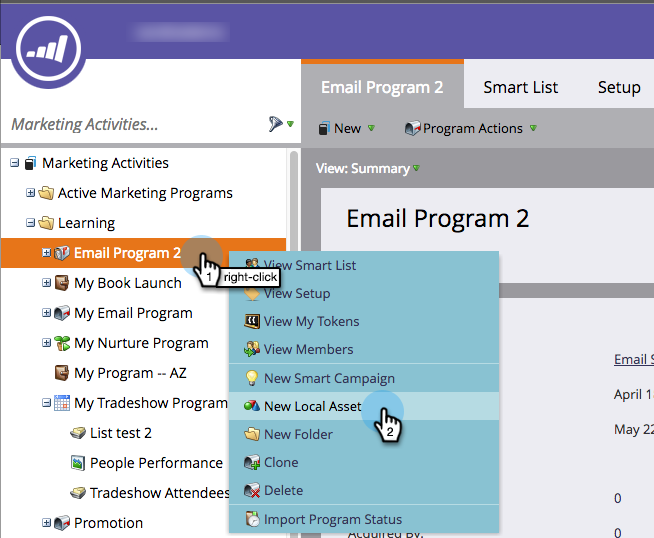

# Création d’un rapport dans un Programme {#create-a-report-in-a-program}

Exécutez un rapport pour analyser les personnes, vos programmes, landings page, courriels et ressources sociales.

1. Accédez à Activités **** marketing.
1. 

1. Sélectionnez un programme.

   

   >[!NOTE]
   >
   >Vous pouvez également créer des rapports à partir de l’onglet **Analytics** .

   Cliquez avec le bouton droit sur le programme et sélectionnez Nouveau fichier local.

   

1. Cliquez sur **Rapport**.

   

1. Sélectionnez le **type** de rapport.

   

   >[!TIP]
   >
   >Consultez [`Report Type Overview`](http://docs.marketo.com/display/DOCS/Report+Type+Overview) une brève description de chacun.

   Nommez votre rapport.

   

   >[!TIP]
   >
   >Pour faciliter la navigation dans les rapports ultérieurement, ajoutez une référence au type de rapport dans le nom.

   Définissez la période du rapport. Voir [Modification de la période](../../../../product-docs/reporting/basic-reporting/editing-reports/change-a-report-time-frame.md) d’un rapport pour plus d’informations.

1. Cliquez sur l’onglet **Rapport** pour afficher vos statistiques.

   

   >[!NOTE]
   >
   >**Plongée profonde**
   >
   >
   >Par défaut, les rapports couvrent l’ensemble des activités de votre compte, d’un programme à l’autre. Pour découvrir les nombreuses méthodes de filtrage de votre rapport, consultez la plongée en profondeur [de Rapports](http://docs.marketo.com/display/docs/basic+reporting) de base.

   >[!NOTE]
   >
   >**Rappel**
   >
   >
   >Vous pouvez rapidement obtenir de nombreux rapports. Pensez à [supprimer un rapport](../../../../product-docs/reporting/basic-reporting/report-activity/delete-a-report.md) dont vous n’avez plus besoin.

   >[!NOTE]
   >
   >**Articles connexes**
   >
   >
   >Vous pouvez [modifier la période](../../../../product-docs/reporting/basic-reporting/editing-reports/change-a-report-time-frame.md)d’un rapport, vous [abonner à un rapport](../../../../product-docs/reporting/basic-reporting/report-subscriptions/subscribe-to-a-basic-report.md)de base, [exporter un rapport vers Excel](../../../../product-docs/reporting/basic-reporting/report-activity/export-a-report-to-excel.md), [filtrer les personnes d’un rapport avec une liste intelligente et plus.](../../../../product-docs/reporting/basic-reporting/editing-reports/filter-people-in-a-report-with-a-smart-list.md)

