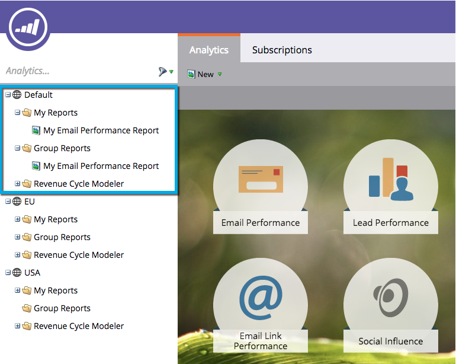

# Présentation de Mes rapports et des rapports de groupe {#understanding-my-reports-and-group-reports}

Vous pouvez créer **[!UICONTROL Mes rapports]** et **[!UICONTROL Rapports de groupe]** à partir de l’[Accueil Analytics](/help/marketo/product-docs/reporting/basic-reporting/creating-reports/navigating-the-analytics-home-page.md).

**[!UICONTROL Mes rapports]** ne sont visibles que par vous.

Les **[!UICONTROL rapports de groupe]** sont visibles par tous les utilisateurs dans cet espace de travail.

>[!NOTE]
>
>Chaque espace de travail comporte un ensemble de **[!UICONTROL Mes rapports]** et **[!UICONTROL Rapports de groupe]**.

>[!MORELIKETHIS]
>
>* [Enregistrer un rapport](/help/marketo/product-docs/reporting/basic-reporting/creating-reports/save-a-report.md)
>* [Cloner un rapport pour regrouper des rapports](/help/marketo/product-docs/reporting/basic-reporting/report-activity/clone-a-report-to-group-reports.md)
