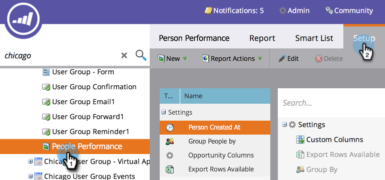

# Ajouter des colonnes personnalisées à un rapport Personne {#add-custom-columns-to-a-person-report}

Vous pouvez filtrer davantage les mesures dans vos rapports [personne](http://docs.marketo.com/display/docs/basic+reporting) en utilisant vos [listes dynamiques](http://docs.marketo.com/display/docs/smart+lists+and+static+lists) comme colonnes personnalisées.

1. Accédez à la zone **Activités marketing** (ou **Analytics**).

   

1. Sélectionnez votre rapport et cliquez sur l&#39;onglet **Configuration**.

   

1. Faites glisser le pointeur de la souris sur **Colonnes personnalisées**.

   

1. Sélectionnez les listes dynamiques à utiliser en tant que colonnes de rapports.

   

   >[!NOTE]
   >
   >**Plongée profonde**
   >
   >
   >Découvrez comment créer et configurer des listes intelligentes dans la plongée profonde [Smart Listes and Static Listes](http://docs.marketo.com/display/docs/smart+lists+and+static+lists).

1. Tu l&#39;as fait ! Cliquez sur l&#39;onglet **Rapport** pour afficher votre rapport avec les nouvelles colonnes.

   

   >[!NOTE]
   >
   >**Articles connexes**
   >
   >
   >Vous pouvez également [Ajouter des colonnes d&#39;opportunité à un rapport de piste](add-opportunity-columns-to-a-lead-report.md).

   >[!NOTE]
   >
   >**Plongée profonde**
   >
   >
   >Découvrez plus en détail les nombreuses choses que vous pouvez faire avec les rapports dans la plongée profonde [Rapports de base](http://docs.marketo.com/display/docs/basic+reporting).

