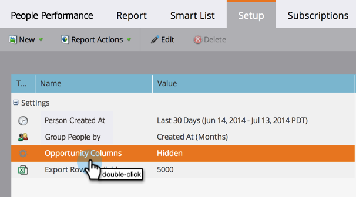

# Ajouter les colonnes d&#39;opportunité à un rapport de piste {#add-opportunity-columns-to-a-lead-report}

Pour afficher les statistiques sur les opportunités dans vos rapports personnels, vous pouvez ajouter des colonnes opportunités.

1. Accédez à la zone Activités **** marketing.

   

1. Sélectionnez votre rapport dans l&#39;arborescence de navigation et cliquez sur l&#39;onglet **Configuration** .

   

1. Doublon-cliquez sur Colonnes **** d&#39;opportunité.

   

1. Sélectionnez **Afficher** dans le menu déroulant.

   

1. Cliquez sur l&#39;onglet **Rapport** pour afficher votre rapport avec les mesures d&#39;opportunité.

   

   >[!TIP]
   >
   >Faites défiler vers la droite pour afficher d’autres colonnes.

1. Pour [ajouter ou supprimer des colonnes du rapport](select-report-columns.md), cliquez sur un en-tête de colonne et sélectionnez **Colonnes**.

   

   Les colonnes des opportunités disponibles sont les suivantes :

   >[!NOTE]
   >
   >Chaque opportunité est comptabilisée une seule fois, en fonction du contact Principal qui lui est affecté.

   | Colonne | Description |
   |---|---|
   | Aucune opportunité | Nombre de personnes qui *ne sont pas* un contact d&#39;opportunité Principal. |
   | Jours sans opportunité | Âge moyen, en jours, des personnes qui *ne sont pas* un contact Principal. |
   | A une opportunité | Nombre de personnes qui sont un contact d&#39;opportunité Principal. |
   | A un % d&#39;opportunité | Pourcentage de personnes qui sont un contact Principal. |
   | Jours jusqu&#39;à l&#39;opportunité | Nombre moyen de jours pour la conversion d&#39;une personne à un contact d&#39;opportunité Principal. |
   | Montant total de l&#39;opportunité | Somme de tous les montants d&#39;opportunité. |
   | Montant moyen de l&#39;opportunité | Somme des quantités d&#39;opportunités, divisée par le nombre d&#39;opportunités. |
   | Opportunité totale | Nombre de toutes les opportunités. |
   | Fermé | Nombre d&#39;opportunités qui ont été fermées, gagnées ou perdues. |
   | Remporté | Nombre d&#39;opportunités qui ont été gagnées. |
   | % gagné | Pourcentage d&#39;opportunités qui ont été gagnées. |
   | Montant total gagné | Somme des montants d&#39;opportunité remportés. |
   | Jours avant fermeture | Nombre moyen de jours pour fermer les opportunités. |
   | Jours de vente | Durée moyenne du cycle de vente (jours jusqu&#39;à l&#39;opportunité + jours avant la fermeture). |

   >[!NOTE]
   >
   >**Articles connexes**
   >
   >
   >Découvrez comment [gérer la taille de votre rapport](configure-report-size.md).

   >[!NOTE]
   >
   >**Plongée profonde**
   >
   >
   >Découvrez ce que vous pouvez faire d&#39;autre avec les rapports dans la plongée [Basic Rapports](http://docs.marketo.com/display/docs/basic+reporting) deep dive.

