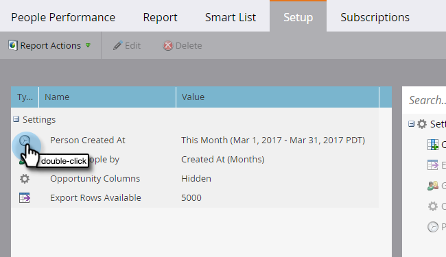

# Modification de la période d’un rapport {#change-a-report-time-frame}

Modifiez la période couverte par votre rapport afin de vous concentrer sur un moment spécifique de l’activité.

1. Accédez à la zone **Activités marketing** (ou **Analytics**).

   

1. Sélectionnez votre rapport dans l’arborescence de navigation et cliquez sur l’onglet **Configuration** .

   

1. Double-cliquez sur le champ de période, étiqueté différemment selon le type de rapport :

   * **Personne créée à**, dans les rapports de personne
   * **Date d’envoi**, dans les rapports par e-mail
   * **Date de l’activité**, dans tous les autres rapports

   

   >[!NOTE]
   >
   >**Personne créée à** fait référence au moment où la personne est devenue connue dans votre base de données.

1. Sélectionnez la période appropriée dans le menu déroulant.

   

   >[!TIP]
   >
   >Pour définir des dates spécifiques, sélectionnez **Personnalisé** dans le menu déroulant et saisissez les dates dans les champs de calendrier **De** et **À** .

   Cliquez sur l’onglet **Rapport** pour afficher votre rapport pour la période sélectionnée.\
   

   >[!MORELIKETHIS]
   >
   >Pour limiter votre rapport en fonction d’attributs de personne spécifiques, vous pouvez [Filtrer les personnes dans un rapport avec une liste dynamique](/help/marketo/product-docs/reporting/basic-reporting/editing-reports/filter-people-in-a-report-with-a-smart-list.md).
