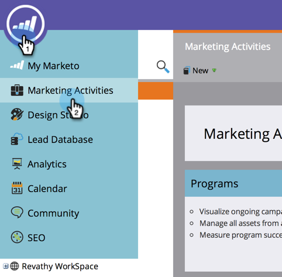

# Configurer la taille du rapport {#configure-report-size}

Par défaut, les rapports Marketo sont limités à un maximum de 5 000 lignes, mais vous pouvez modifier ce nombre.

1. Accédez à la zone **[!UICONTROL Activités marketing]**.

   

1. Sélectionnez votre rapport dans l’arborescence de navigation et cliquez sur l’onglet **[!UICONTROL Configuration]**.

   

1. Double-cliquez sur **[!UICONTROL Exporter les lignes disponibles]**.

   

1. Sélectionnez la nouvelle limite.

   

   >[!TIP]
   >
   >La modification de la limite modifie la taille du rapport elle-même, pas seulement le fichier [!DNL Excel] exporté. Par conséquent, si la génération de votre rapport prend trop de temps, réduisez la limite.

1. Cliquez sur **[!UICONTROL Enregistrer]** pour confirmer la nouvelle limite.

   

   Vous avez terminé ! Le rapport respectera la nouvelle limite.

   >[!MORELIKETHIS]
   >
   >Vous pouvez [exporter votre rapport](/help/marketo/product-docs/reporting/basic-reporting/report-activity/export-a-report-to-excel.md) avec la nouvelle limite.
