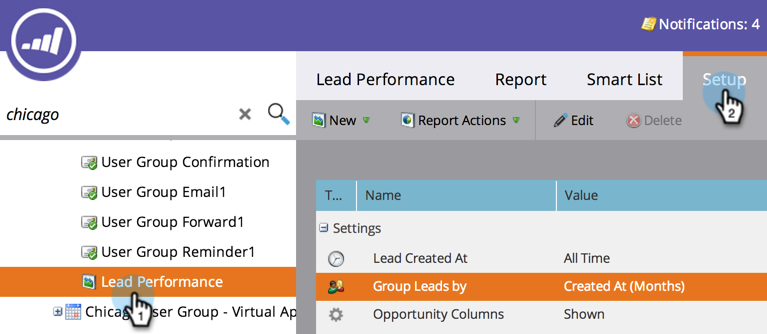

# Configurer la taille du rapport {#configure-report-size}

Par défaut, les rapports Marketo sont limités à un maximum de 5 000 lignes, mais vous pouvez modifier cette limite.

1. Accédez à la zone **Activités marketing**.

   

1. Sélectionnez votre rapport dans l&#39;arborescence de navigation et cliquez sur l&#39;onglet **Configuration**.

   

1. Doublon-clic **Exporter lignes disponibles**.

   

1. Sélectionnez la nouvelle limite.

   

   >[!TIP]
   >
   >La modification de la limite modifie la taille du rapport lui-même, et pas seulement le fichier Excel exporté. Par conséquent, si la génération du rapport prend trop de temps, réduisez la limite !

1. Cliquez sur **Enregistrer** pour confirmer la nouvelle limite.

   

   Vous avez fini ! Le rapport respectera la nouvelle limite.

   >[!MORELIKETHIS]
   >
   >Vous pouvez [exporter votre rapport](/help/marketo/product-docs/reporting/basic-reporting/report-activity/export-a-report-to-excel.md) avec la nouvelle limite.
