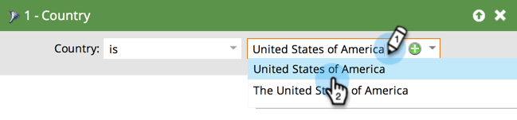

# Filtrer des personnes dans un rapport avec une liste intelligente {#filter-people-in-a-report-with-a-smart-list}

Utilisez des listes dynamiques pour filtrer vos rapports en fonction d’attributs de personne spécifiques.

Vous pouvez utiliser des listes dynamiques avec les types de rapports suivants :

* [Performance des individus](/help/marketo/product-docs/reporting/basic-reporting/report-types/people-performance-report.md)
* [Individus par statut](/help/marketo/product-docs/reporting/basic-reporting/report-types/people-by-status-report.md)
* [Individus par étape de revenu](/help/marketo/product-docs/reporting/revenue-cycle-analytics/revenue-tools/people-by-revenue-stage-report.md)
* [Performance des e-mails](/help/marketo/product-docs/email-marketing/email-programs/email-program-data/email-performance-report.md)
* [Performance du lien par e-mail](/help/marketo/product-docs/email-marketing/email-programs/email-program-data/email-link-performance-report.md)
* [Performance du stream d&#39;engagement](/help/marketo/product-docs/email-marketing/drip-nurturing/reports-and-notifications/engagement-stream-performance-report.md)
* [Performance campagne e-mail](/help/marketo/product-docs/reporting/basic-reporting/report-types/campaign-email-performance-report.md)
* [Activité Web de la société](/help/marketo/product-docs/reporting/basic-reporting/report-types/company-web-activity-report.md)
* [Activité de page Internet](/help/marketo/product-docs/reporting/basic-reporting/report-types/web-page-activity-report.md)

1. Accédez à la zone **[!UICONTROL Activités marketing]**.

   

1. Sélectionnez votre rapport dans l’arborescence de navigation et cliquez sur l’onglet **[!UICONTROL Liste dynamique]**.

   

1. Recherchez le filtre approprié et faites-le glisser sur la page.

   

1. Configurez le filtre .

   

1. Cliquez sur l’onglet **[!UICONTROL Rapport]** pour afficher votre rapport filtré.

   

   Fantastique ! Désormais, votre rapport affiche uniquement les données des personnes qui correspondent à la liste dynamique.
