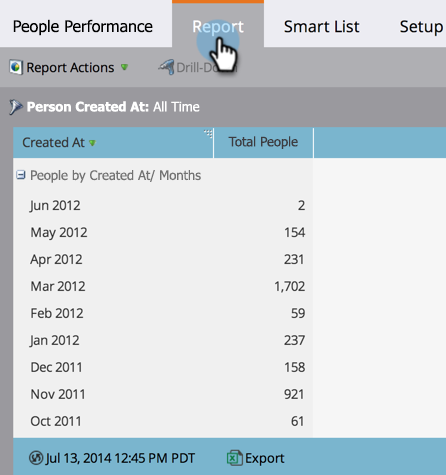

# Filtrage des personnes dans un rapport avec une Liste intelligente {#filter-people-in-a-report-with-a-smart-list}

Utilisez des listes intelligentes pour filtrer vos rapports selon des attributs de personne spécifiques.

>[!NOTE]
>
>**FYI**
>
>Marketo est maintenant en train de normaliser la langue dans tous les abonnements. Vous pouvez donc voir des pistes dans votre abonnement et des personnes/personnes dans docs.marketo.com. Ces termes signifient la même chose ; cela n&#39;a aucune incidence sur les instructions relatives aux articles. Il y a aussi d&#39;autres changements. [En savoir plus](http://docs.marketo.com/display/DOCS/Updates+to+Marketo+Terminology).

Vous pouvez utiliser des listes intelligentes avec les types de rapports suivants :

* [Performances des personnes](../../../../product-docs/reporting/basic-reporting/report-types/people-performance-report.md)
* [Personnes par statut](../../../../product-docs/reporting/basic-reporting/report-types/people-by-status-report.md)
* [Personnes par étape de recettes](http://docs.marketo.com/display/DOCS/People+by+Revenue+Stage+Report)
* [Performances des courriers électroniques](../../../../product-docs/email-marketing/email-programs/email-program-data/email-performance-report.md)
* [Performances du lien de courriel](../../../../product-docs/email-marketing/email-programs/email-program-data/email-link-performance-report.md)
* [Performances du flux d’engagement](../../../../product-docs/email-marketing/drip-nurturing/reports-and-notifications/engagement-stream-performance-report.md)
* [Activité Campaign](../../../../product-docs/reporting/basic-reporting/report-types/campaign-activity-report.md)
* [Performances des courriers électroniques Campaign](../../../../product-docs/reporting/basic-reporting/report-types/campaign-email-performance-report.md)
* [Activité Web société](../../../../product-docs/reporting/basic-reporting/report-types/company-web-activity-report.md)
* [Activité de page Web](../../../../product-docs/reporting/basic-reporting/report-types/web-page-activity-report.md)

1. Accédez à la zone Activités **** marketing.

   

1. Sélectionnez votre rapport dans l&#39;arborescence de navigation et cliquez sur l&#39;onglet Liste **** intelligente.

   

1. Recherchez le filtre approprié et faites-le glisser.

   

1. Configurez le filtre.

   

1. Cliquez sur l’onglet **Rapport** pour afficher votre rapport filtré.

   

   Super ! Votre rapport présente maintenant les données pour les personnes qui correspondent à la liste intelligente.

   >[!NOTE]
   >
   >**Plongée profonde**
   >
   >
   >Pour plus d&#39;informations sur l&#39;utilisation des rapports, reportez-vous à la section plongée en profondeur du Rapports [de](http://docs.marketo.com/display/docs/basic+reporting) base.

