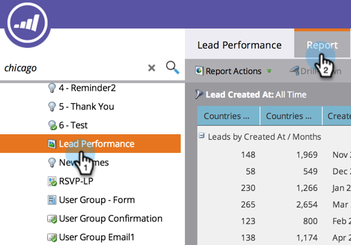

# Réorganiser les colonnes du rapport {#reorder-report-columns}

Vous pouvez modifier l’ordre des colonnes d’un rapport.

1. Accédez au **Activités marketing** (ou **Analytics**).

   

1. Sélectionnez votre rapport dans l’arborescence de navigation, puis cliquez sur le bouton **Rapport** .

   

1. Cliquez sur la colonne et maintenez-la enfoncée pour la faire glisser vers la nouvelle position, puis relâchez le bouton de la souris.

   

1. C&#39;est tout ! Les colonnes s’affichent désormais dans le nouvel ordre.

   

   Vous pouvez répéter ces étapes jusqu’à ce que les colonnes apparaissent dans l’ordre qui vous convient le mieux.

   >[!MORELIKETHIS]
   >
   >[Sélectionner les colonnes du rapport](/help/marketo/product-docs/reporting/basic-reporting/editing-reports/select-report-columns.md)
