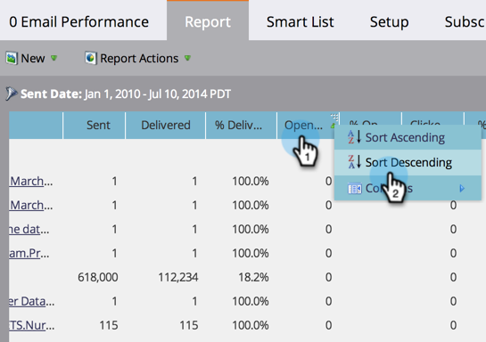

# Trier le rapport sur des colonnes {#sort-report-on-columns}

Utilisez des colonnes pour trier les données de votre rapport et faciliter la recherche des chiffres les plus importants.

1. Accédez à **[!UICONTROL Analytics]** (ou **[!UICONTROL Activités marketing]**).

   

1. Sélectionnez votre rapport dans l’arborescence de navigation, puis cliquez sur l’onglet **[!UICONTROL Rapport]**.

   

1. Cliquez sur la colonne la plus importante et sélectionnez un ordre de tri.

   

1. Fantastique ! Vous pouvez maintenant vous concentrer sur les données les plus intéressantes de votre rapport.

   

   >[!MORELIKETHIS]
   >
   >[Sélectionner les colonnes du rapport](/help/marketo/product-docs/reporting/basic-reporting/editing-reports/select-report-columns.md)
