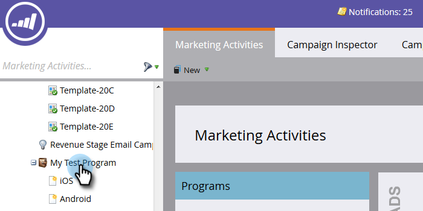

# Créer un rapport sur les performances des personnes avec des colonnes de plateformes mobiles {#build-a-people-performance-report-with-mobile-platform-columns}

Pour créer un rapport sur les performances des personnes avec des colonnes de plateformes mobiles (iOS/Android), procédez comme suit.

## Créer des Listes mobiles dynamiques {#create-mobile-smart-lists}

1. Accédez à **Activités marketing**.

   

1. Choisissez un programme.

   

1. Sous **New**, sélectionnez **New Local Asset**.

   

1. Cliquez sur **Liste intelligente**.

   

1. Saisissez un nom et cliquez sur **Créer**.

   

1. Recherchez et faites glisser le filtre Courrier électronique ouvert dans le canevas.

   

1. Définissez Courriel sur **est n’importe quel**.

   

1. Cliquez sur **Ajouter la contrainte** et sélectionnez **Plateforme**.

   

   >[!TIP]
   >
   >Nous avons utilisé le filtre Courrier électronique ouvert dans cet exemple. Vous pouvez également utiliser le filtre Courrier électronique cliqué, car il comporte la contrainte Plateforme.

1. Définissez la plate-forme sur **iOS**.

   

   >[!NOTE]
   >
   >Au moins une personne doit avoir ouvert l’un de vos courriels sur un périphérique iOS pour que Marketo propose automatiquement de le trouver. S’il ne s’affiche pas, vous pouvez le saisir manuellement et l’enregistrer.

   Créez maintenant une seconde liste intelligente pour la plate-forme &quot;Android&quot;. Une fois cela fait, passez à la section suivante.

## Créer un rapport sur les performances des personnes {#create-a-people-performance-report}

1. Sous Activités marketing, sélectionnez le programme qui héberge vos **listes dynamiques &lt;a0/>iOS** et **Android**.

   

1. Sous **New**, sélectionnez **New Local Asset**.

   

1. Cliquez sur **Rapport**.

   

1. Définissez le type sur **Performance des personnes**.

   

1. Cliquez sur **Créer**.

   

   Tu te débrouilles bien ! Passons maintenant à la section suivante.

## Ajouter les Listes dynamiques mobiles en tant que colonnes {#add-mobile-smart-lists-as-columns}

1. Dans le rapport que vous venez de créer, cliquez sur **Configuration**, puis faites glisser **Colonnes personnalisées** dans le canevas.

   

   >[!NOTE]
   >
   >Par défaut, le rapport Performance des personnes examine les 7 derniers jours. Vous pouvez modifier la période en cliquant sur celle-ci par doublon.

1. Recherchez et sélectionnez les listes dynamiques que vous avez créées précédemment et cliquez sur **Appliquer**.

   

1. Cliquez sur **Rapport** pour exécuter le rapport et afficher vos données.

   

   Plutôt cool, non ? Bien joué !

