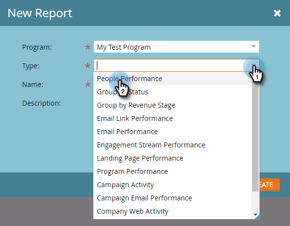

# Créer un rapport de performances des personnes avec des colonnes Mobile Platform {#build-a-people-performance-report-with-mobile-platform-columns}

Pour créer un rapport de performances des personnes avec des colonnes de plateforme mobile (iOS/Android), procédez comme suit.

## Créer des listes dynamiques mobiles {#create-mobile-smart-lists}

1. Accédez à **[!UICONTROL Activités marketing]**.

   

1. Choisissez un programme.

   

1. Sous **[!UICONTROL Nouveau]**, sélectionnez **[!UICONTROL Nouvelle ressource locale]**.

   

1. Cliquez sur **[!UICONTROL Liste dynamique]**.

   

1. Saisissez un nom, puis cliquez sur **[!UICONTROL Créer]**.

   

1. Recherchez le filtre [!UICONTROL E-mail ouvert] et faites-le glisser dans la zone de travail.

   

1. Définissez E-mail sur **[!UICONTROL est n’importe lequel]**.

   

1. Cliquez sur **[!UICONTROL Ajouter une contrainte]** et sélectionnez **[!UICONTROL Plateforme]**.

   

   >[!TIP]
   >
   >Dans cet exemple, nous avons utilisé le filtre [!UICONTROL E-mail ouvert]. Vous pouvez également utiliser le filtre [!UICONTROL E-mail cliqué], car il contient la contrainte Plateforme .

1. Définissez [!UICONTROL Platform] sur **[!UICONTROL iOS]**.

   

   >[!NOTE]
   >
   >Au moins une personne doit avoir ouvert l’un de vos e-mails sur un appareil iOS pour que les suggestions automatiques de Marketo puissent le retrouver. S’il n’apparaît pas, vous pouvez le saisir manuellement et l’enregistrer.

   Créez maintenant une deuxième liste dynamique pour la plateforme « Android ». Une fois que c&#39;est fait, passez à la section suivante.

## Créer un rapport de performances des personnes {#create-a-people-performance-report}

1. Sous Activités marketing, sélectionnez le programme qui héberge vos listes dynamiques **[!UICONTROL iOS]** et **[!UICONTROL Android]**.

   

1. Sous **[!UICONTROL Nouveau]**, sélectionnez **[!UICONTROL Nouvelle ressource locale]**.

   

1. Cliquez sur **[!UICONTROL Rapport]**.

   

1. Définissez Type sur **[!UICONTROL Performances des personnes]**.

   

1. Cliquez sur **[!UICONTROL Créer]**.

   

   Vous vous en sortez bien ! Passez maintenant à la section suivante.

## Ajouter des listes dynamiques mobiles en tant que colonnes {#add-mobile-smart-lists-as-columns}

1. Dans le rapport que vous venez de créer, cliquez sur **[!UICONTROL Configuration]**, puis faites glisser **[!UICONTROL Colonnes personnalisées]** dans la zone de travail.

   

   >[!NOTE]
   >
   >Par défaut, le rapport Performances des personnes examine les 7 derniers jours. Vous pouvez modifier la période en double-cliquant dessus.

1. Recherchez et sélectionnez les listes dynamiques que vous avez créées précédemment et cliquez sur **[!UICONTROL Appliquer]**.

   

1. Cliquez sur **[!UICONTROL Rapport]** pour exécuter le rapport et afficher vos données.

   

   Plutôt cool, non ? Bien joué !
