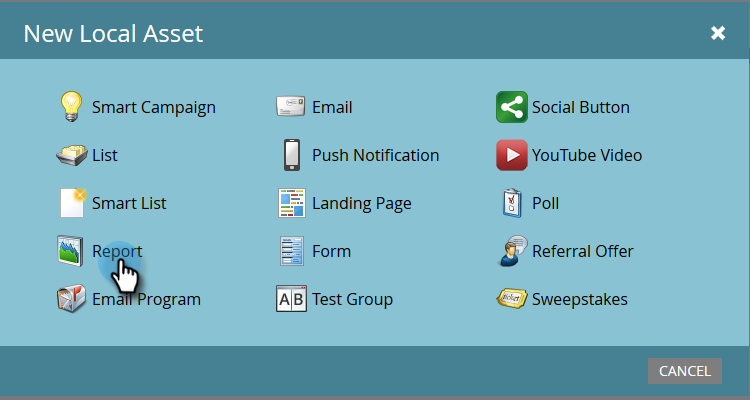

# Création d’un rapport sur les performances des personnes avec des colonnes Mobile Platform {#build-a-people-performance-report-with-mobile-platform-columns}

Pour créer un rapport Performance des personnes avec des colonnes de plateforme mobile (iOS/Android), procédez comme suit.

## Création de listes dynamiques mobiles {#create-mobile-smart-lists}

1. Accédez à **Activités marketing**.

   

1. Choisissez un programme.

   

1. Sous **New**, sélectionnez **New Local Asset**.

   

1. Cliquez sur **Liste dynamique**.

   

1. Saisissez un nom et cliquez sur **Créer**.

   

1. Recherchez et faites glisser le filtre Courrier électronique ouvert dans la zone de travail.

   

1. Définissez Email sur **est n’importe quel**.

   

1. Cliquez sur **Ajouter la contrainte** et sélectionnez **Plateforme**.

   

   >[!TIP]
   >
   >Nous avons utilisé le filtre Courrier électronique ouvert dans cet exemple. Vous pouvez également utiliser le filtre Email cliqué , car il a la contrainte Platform .

1. Définissez Platform sur **iOS**.

   

   >[!NOTE]
   >
   >Au moins une personne doit avoir ouvert l’un de vos emails sur un appareil iOS pour que Marketo vous suggère de le trouver automatiquement. S’il ne s’affiche pas, vous pouvez le saisir manuellement et l’enregistrer.

   Créez maintenant une deuxième liste dynamique pour la plateforme &quot;Android&quot;. Une fois cela fait, passez à la section suivante.

## Création d’un rapport Performance des personnes {#create-a-people-performance-report}

1. Sous Activités marketing, sélectionnez le programme qui héberge vos listes dynamiques **iOS** et **Android**.

   

1. Sous **New**, sélectionnez **New Local Asset**.

   

1. Cliquez sur **Report**.

   

1. Définissez le type sur **Performance des personnes**.

   

1. Cliquez sur **Créer**.

   

   Tu t&#39;en sors bien ! Passons à la section suivante.

## Ajout de listes dynamiques mobiles en tant que colonnes {#add-mobile-smart-lists-as-columns}

1. Dans le rapport que vous venez de créer, cliquez sur **Configuration**, puis faites glisser **Colonnes personnalisées** dans la zone de travail.

   

   >[!NOTE]
   >
   >Par défaut, le rapport Performance des personnes examine les 7 derniers jours. Vous pouvez modifier la période en double-cliquant dessus.

1. Recherchez et sélectionnez les listes dynamiques que vous avez créées précédemment et cliquez sur **Appliquer**.

   

1. Cliquez sur **Rapport** pour exécuter le rapport et afficher vos données.

   

   Plutôt cool, n&#39;est-ce pas ? C&#39;est joli !
