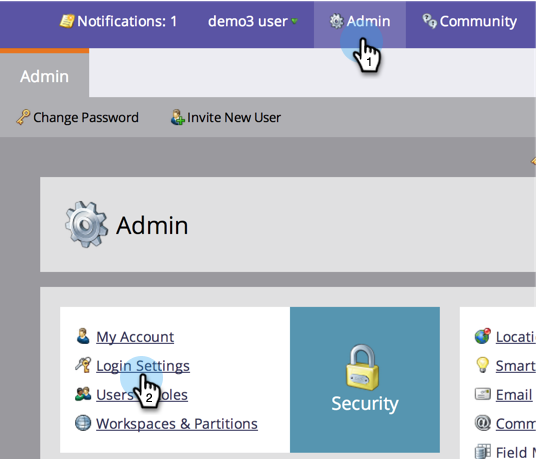

# Modification de l’heure d’expiration des URL dans les messages électroniques de rapport {#change-the-expiration-time-for-urls-in-report-emails}

>[!NOTE]
>
>**Autorisations d’administrateur requises**

Les liens contenus dans les emails d’abonnement à votre rapport expirent au bout de trois jours. Pour modifier le délai d’expiration de ces liens, procédez comme suit.

1. Sous **Admin**, cliquez sur **Paramètres de connexion**.

   

1. Cliquez sur le bouton **Edit URL Expiration** (Modifier l’expiration de l’URL).

   

1. Dans le menu déroulant, sélectionnez le nombre de jours avant l’expiration du lien. Cliquez sur **Enregistrer**.

   

   Cool, vous avez modifié les paramètres d&#39;expiration des liens d&#39;email.

   >[!NOTE]
   >
   >Pour rappel, elles s’appliquent uniquement aux liens des rapports et alertes, et non aux emails marketing.
