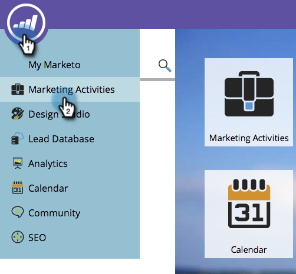

# Cloner un rapport {#clone-a-report}

Créez un doublon de votre rapport pour le personnaliser davantage sans modifier l’original.

1. Accédez à la zone **[!UICONTROL Activités marketing]** (ou **[!UICONTROL Analytics]**).

   

1. Sélectionnez votre rapport. Sélectionnez **[!UICONTROL Actions du rapport]** > **[!UICONTROL Cloner un rapport]**.

   

   >[!TIP]
   >
   >Vous pouvez également cloner un rapport en cliquant dessus avec le bouton droit dans l’arborescence.

1. Nommez votre clone de rapport.

   

   Voilà, vous êtes prêt à personnaliser votre clone !

   >[!MORELIKETHIS]
   >
   >[Filtrer des personnes dans un rapport avec une liste dynamique](/help/marketo/product-docs/reporting/basic-reporting/editing-reports/filter-people-in-a-report-with-a-smart-list.md)
