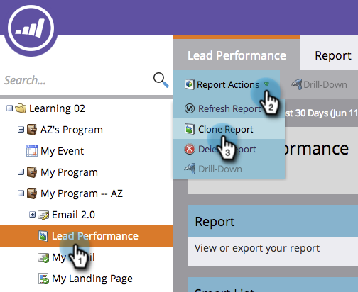

# Cloner un rapport {#clone-a-report}

Créez un duplicata de votre rapport pour le personnaliser davantage sans modifier l&#39;original.

1. Accédez à **Activités marketing** (ou **Analytics**).

   

1. Sélectionnez votre rapport. Sélectionnez **Actions de rapport > Cloner un rapport**.

   

   >[!TIP]
   >
   >Vous pouvez également cloner un rapport en cliquant dessus avec le bouton droit dans l&#39;arborescence.

1. Nommez votre clone de rapport.

   

   C&#39;est tout. Vous êtes prêt à début la personnalisation de votre clone !

   >[!MORELIKETHIS]
   >
   >
   >    
   >    
   >    * [Filtrage des personnes dans un rapport avec une Liste intelligente](../../../../product-docs/reporting/basic-reporting/editing-reports/filter-people-in-a-report-with-a-smart-list.md)

   Faites beaucoup plus pour personnaliser votre rapport ! Voir [Rapports de base](http://docs.marketo.com/display/docs/basic+reporting).

