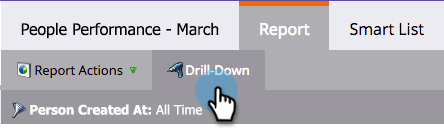

# Analyser en profondeur un rapport sur les performances des personnes {#drill-down-in-a-people-performance-report}

Analyser en profondeur un rapport de performances des personnes pour afficher des informations supplémentaires sur la personne.

1. Cliquez sur l’onglet **[!UICONTROL Rapport]** pour afficher un rapport existant.

   

1. Sélectionnez une ligne du rapport sur laquelle vous souhaitez en savoir plus.

   

1. Cliquez sur **[!UICONTROL Zoom]**.

   

1. Dans le pop-up **[!UICONTROL Analyse en profondeur]**, sélectionnez l’attribut que vous souhaitez analyser en profondeur. Cliquez ensuite sur **[!UICONTROL Zoom]**.

   

1. Très bon travail ! Le rapport détaillé s’ouvre dans un nouvel onglet. Vous pouvez maintenant explorer le nouveau rapport.

   >[!TIP]
   >
   >Si aucun nouvel onglet de rapport n’est ouvert, il se peut que votre navigateur bloque les fenêtres contextuelles. Modifiez les paramètres de votre navigateur pour l’autoriser.

   

1. Pour enregistrer vos résultats (facultatif), cliquez sur l’icône **[!UICONTROL Exporter]** en bas à gauche.

   
