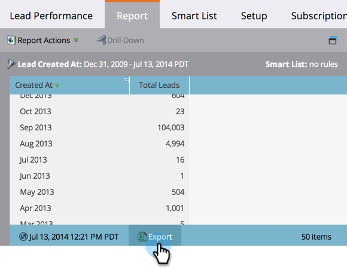

# Exportation d’un rapport vers Excel {#export-a-report-to-excel}

Vous pouvez exporter n’importe quel rapport dans un fichier Excel pour utiliser les données d’un autre logiciel.

1. Accédez à la zone Activités **** marketing.

   

1. Sélectionnez votre rapport dans l&#39;arborescence de navigation et cliquez sur l&#39;onglet **Rapport** .

   

1. Cliquez sur le bouton **Exporter** .

   

   C&#39;est tout ! Votre navigateur vous invite à enregistrer le fichier Excel sur votre système.

   >[!NOTE]
   >
   >**Articles connexes**
   >
   >
   >Si le fichier téléchargé est trop volumineux, vous pouvez [modifier la taille](../../../../product-docs/reporting/basic-reporting/editing-reports/configure-report-size.md) du rapport.

   >[!NOTE]
   >
   >**Plongée profonde**
   >
   >
   >Découvrez toutes les autres actions utiles que vous pouvez effectuer avec les rapports dans la plongée [Basic Rapports](http://docs.marketo.com/display/docs/basic+reporting) deep dive.

