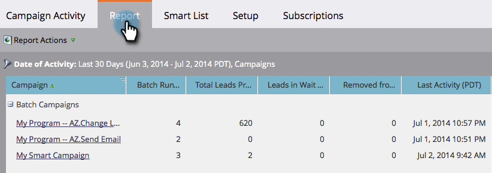

# Filtrer un rapport d’activité de campagne {#filter-a-campaign-activity-report}

Concentrez votre [rapport d’activité de campagne](/help/marketo/product-docs/reporting/basic-reporting/report-types/campaign-activity-report.md) sur des [campagnes intelligentes](/help/marketo/product-docs/core-marketo-concepts/smart-campaigns/creating-a-smart-campaign/understanding-batch-and-trigger-smart-campaigns.md) spécifiques.

>[!NOTE]
>
>Le filtrage des ressources dans les rapports n’est pas pris en charge en mode satellite (icône « ouvrir dans une nouvelle fenêtre » sur la droite de la page des détails de la ressource).

1. Accédez à **Activités marketing** (ou **Analytics**) et sélectionnez votre rapport d’activité de campagne.

   

1. Cliquez sur l’onglet **[!UICONTROL Configuration]** et double-cliquez sur **[!UICONTROL Campagnes]**.

   

1. Choisissez les dossiers et les campagnes intelligentes spécifiques à inclure dans votre rapport. Cliquez sur **[!UICONTROL Appliquer]**.

   

   >[!TIP]
   >
   >Si vous sélectionnez un dossier, votre rapport inclura tout ce qu’il contient au moment de son exécution.

1. C&#39;est fini ! Cliquez sur l’onglet **[!UICONTROL Rapport]** pour afficher _uniquement_ les campagnes intelligentes sélectionnées dans votre rapport.

   

>[!MORELIKETHIS]
>
>[Rapport sur les performances des emails de Campaign](/help/marketo/product-docs/reporting/basic-reporting/report-types/campaign-email-performance-report.md)
