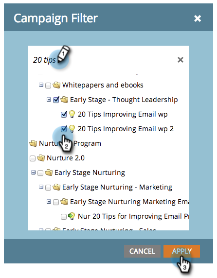

# Filtrage d’Assets dans les rapports de messagerie d’une campagne {#filter-assets-in-a-campaign-email-reports}

Concentrez votre rapport [Performances des emails de campagne](/help/marketo/product-docs/reporting/basic-reporting/report-types/campaign-email-performance-report.md) sur des [campagnes intelligentes](/help/marketo/product-docs/core-marketo-concepts/smart-campaigns/creating-a-smart-campaign/understanding-batch-and-trigger-smart-campaigns.md) spécifiques dans vos programmes (&#39;ressources locales&#39;) ou sur ceux qui ont été archivés.

>[!NOTE]
>
>Le filtrage des ressources dans les rapports n’est pas pris en charge en mode satellite (l’icône &quot;Ouvrir dans une nouvelle fenêtre&quot; située à droite de la page des détails de la ressource).

1. Accédez à la zone **Analytics** (ou **Activités marketing**).

   

1. Sélectionnez votre rapport de performances des emails.

   

1. Cliquez sur l’onglet **Configuration** et faites glisser sur un filtre.

   

   * **Campagnes** : campagnes dynamiques actives dans votre compte Marketo.
   * **Campagnes archivées** : campagnes intelligentes inactives et retirées.

1. Sélectionnez les dossiers et les campagnes intelligentes spécifiques à inclure dans votre rapport.

   

   >[!TIP]
   >
   >Si vous sélectionnez un dossier, votre rapport inclura tout ce qu’il contient au moment de l’exécution du rapport.

1. Vous avez fini ! Cliquez sur l’onglet **Rapport** pour afficher votre rapport filtré.

   

   >[!MORELIKETHIS]
   >
   >[Rapport Performance de messagerie de Campaign](/help/marketo/product-docs/reporting/basic-reporting/report-types/campaign-email-performance-report.md)
   >[Filtrer Assets dans un rapport par courrier électronique](/help/marketo/product-docs/reporting/basic-reporting/report-activity/filter-assets-in-an-email-report.md)
