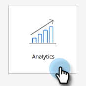
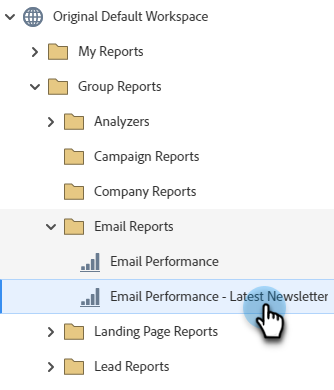

# Filtrer les enregistrements supprimés/fusionnés dans un rapport des performances des e-mails {#filter-deleted-merged-records-in-an-email-performance-report}

Concentrez votre rapport Performance des e-mails sur les e-mails dans vos programmes (« ressources locales »), ceux de Design Studio (« ressources globales ») ou ceux qui ont été archivés.

>[!NOTE]
>
>Le filtrage des ressources dans les rapports n’est pas pris en charge en mode satellite (icône « ouvrir dans une nouvelle fenêtre » sur la droite de la page des détails de la ressource).

1. Accédez à la zone **Analytics** (ou Activités marketing) .

   

1. Sélectionnez votre Rapport sur les performances des e-mails.

   

1. Cliquez sur l’onglet **Configuration** et sélectionnez **Masquer les personnes supprimées/fusionnées**.

   

1. Cliquez dans la liste déroulante, sélectionnez **Activé**, puis cliquez sur **Enregistrer**.

   

C&#39;est fini ! Cliquez sur l’onglet Rapport pour afficher le rapport filtré.
