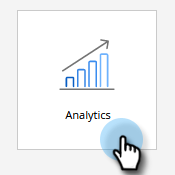

# Filtrer les enregistrements supprimés/fusionnés dans un rapport de performances des emails {#filter-deleted-merged-records-in-an-email-performance-report}

Concentrez votre rapport Performance des emails sur les emails de vos programmes (&#39;ressources locales&#39;), sur ceux de Design Studio (&#39;ressources globales&#39;) ou sur ceux qui ont été archivés.

>[!NOTE]
>
>Le filtrage des ressources dans les rapports n’est pas pris en charge en mode satellite (l’icône &quot;Ouvrir dans une nouvelle fenêtre&quot; située à droite de la page des détails de la ressource).

1. Accédez à la zone **Analytics** (ou Activités marketing).

   

1. Sélectionnez votre rapport Performance de messagerie.

   

1. Cliquez sur l’onglet **Configuration** et sélectionnez **Masquer les personnes supprimées/fusionnées**.

   

1. Cliquez sur la liste déroulante, sélectionnez **Activé**, puis cliquez sur **Enregistrer**.

   

Vous avez fini ! Cliquez sur l’onglet Rapport pour afficher votre rapport filtré.
