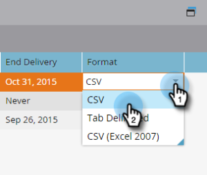

# Modifier l’abonnement à une liste intelligente {#edit-a-smart-list-subscription}

Vous pouvez modifier ces colonnes directement dans l’onglet Abonnements qui s’affiche dans Activités marketing ou Base de données :

* [!UICONTROL Destinataires]
* [!UICONTROL Fréquence]
* [!UICONTROL Colonnes ]
* [!UICONTROL Fin De La Diffusion]
* [!UICONTROL Format]

1. Sélectionnez **[!UICONTROL Base de données]** (nous l’utilisons dans cet exemple, mais les activités marketing fonctionnent exactement de la même manière).

   

1. Sélectionnez l’abonnement à modifier.

   

1. Cliquez dans la colonne **[!UICONTROL Destinataires]** et elle s’ouvre afin que vous puissiez saisir d’autres adresses e-mail (séparez-les par une virgule).

   

1. Cliquez sur la colonne **[!UICONTROL Fréquence]** pour choisir ou modifier votre paramètre.

   

1. Ouvrez la colonne **[!UICONTROL Colonnes]** et utilisez le sélecteur pour ajouter ou supprimer des colonnes du rapport. Colonnes du rapport contient toutes les colonnes disponibles et Colonnes du Marketo affiche uniquement celles que vous avez sélectionnées pour afficher dans votre rapport. Cliquez sur **[!UICONTROL Enregistrer]**

   

   >[!NOTE]
   >
   >Les colonnes sous Colonnes Marketo sont les colonnes du rapport, et non celles utilisées dans l’onglet Rapport d’abonnement .

1. Cliquez sur la colonne **[!UICONTROL Date de fin]** pour modifier la date de fin. Sélectionnez **[!UICONTROL Jamais]** ou **[!UICONTROL Date]**. Pour une date, saisissez-la ou sélectionnez-la dans le calendrier. Cliquez sur **[!UICONTROL Approuver]**.

   

1. La dernière pièce du puzzle est le format. Cliquez sur la colonne **[!UICONTROL Format]** et sélectionnez celle de votre choix. Le format CSV est la valeur par défaut.

   
