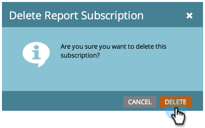

# Gérer les abonnements aux rapports {#manage-report-subscriptions}

Configuration et suppression des abonnements aux rapports.

1. Accédez au **Analytics** zone.

   

1. Cliquez sur le bouton **Abonnements** .

   

   Cette page affiche les abonnements à tous les rapports de votre compte, regroupés par [type de rapport](/help/marketo/product-docs/reporting/basic-reporting/report-types/report-type-overview.md). Cela inclut [abonnements aux rapports de base](/help/marketo/product-docs/reporting/basic-reporting/report-subscriptions/subscribe-to-a-basic-report.md) et aux rapports de l’explorateur de recettes.

   >[!TIP]
   >
   >Vous pouvez également gérer les abonnements à un rapport spécifique dans **Activités marketing**. Sélectionnez le rapport et cliquez sur le bouton **Abonnements** .

   Pour modifier la fréquence d&#39;envoi d&#39;un rapport, cliquez sur le champ Fréquence et sélectionnez une nouvelle option dans le menu déroulant.

   

1. Pour modifier les adresses électroniques d’un abonnement, cliquez sur le bouton **Destinataires de l’e-mail** et éditez les adresses email.

   

   >[!TIP]
   >
   >* Utilisez des virgules entre les adresses électroniques.
   >* Pour enregistrer vos modifications, cliquez sur dans une zone. _external_ la liste des abonnements.

   Vous pouvez également :

   * Cliquez sur le bouton **Affichage** pour ouvrir un rapport.
   * Désélectionnez l’option **Principal** pour désactiver l’abonnement.
   * Cliquez sur et modifiez la variable **Résumé** pour modifier le nombre de lignes d’aperçu qui apparaissent dans l’email.
   * Désélectionnez l’option **Excel** pour envoyer des résumés de rapports sans la pièce jointe de feuille de calcul.
   * Cliquez sur le bouton **Envoyer** pour envoyer immédiatement l’email du rapport.

1. Pour supprimer complètement un abonnement, sélectionnez la ligne et cliquez sur **Supprimer l’abonnement**.

   

1. Confirmez votre intention de supprimer l’abonnement.

   

   >[!MORELIKETHIS]
   >
   >* [Abonnement à un rapport de base](/help/marketo/product-docs/reporting/basic-reporting/report-subscriptions/subscribe-to-a-basic-report.md)
   >* [Abonnement à un rapport de l’Explorateur des recettes](/help/marketo/product-docs/reporting/revenue-cycle-analytics/revenue-explorer/subscribe-to-a-revenue-explorer-report.md)

