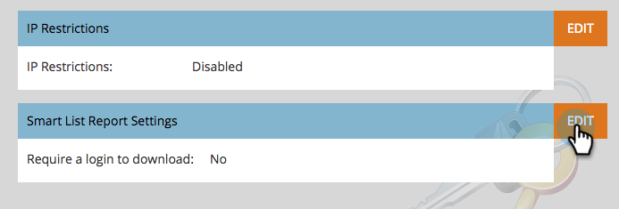

# Sécurisation du paramètre d’administration de l’Abonnement {#secure-the-subscription-admin-setting}

>[!NOTE]
>
>**Autorisations d’administrateur requises**

Un administrateur peut choisir de demander une connexion pour pouvoir vue un rapport.

1. Cliquez sur **Admin**, puis sur Paramètres **de** connexion.

   

1. Cliquez sur **Modifier** pour Paramètres des rapports de Liste intelligente.

   

1. Sélectionnez **Oui** pour exiger une connexion pour télécharger les rapports.

   

   >[!CAUTION]
   >
   >Lorsqu’une connexion est requise pour télécharger des rapports, si vous n’avez pas accès à Marketing Cloud, vous ne recevrez pas d’e-mails de rapport de liste dynamique. Cela s&#39;applique aux abonnements existants et futurs.

