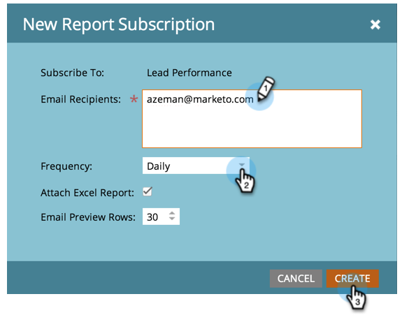
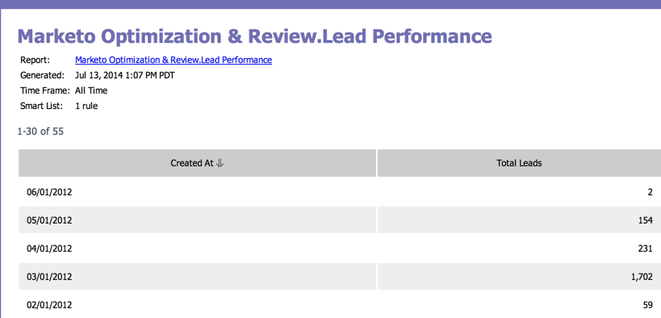

# S’abonner à un rapport de base {#subscribe-to-a-basic-report}

Pour recevoir les mises à jour automatiques d’un rapport de base ou les partager, vous pouvez abonner n’importe quelle adresse e-mail à un rapport existant.

>[!NOTE]
>
>Pour les abonnements à un rapport de l’Explorateur du cycle du chiffre d’affaires, voir [S’abonner à un rapport de l’Explorateur](/help/marketo/product-docs/reporting/revenue-cycle-analytics/revenue-explorer/subscribe-to-a-revenue-explorer-report.md).

1. Accédez à la zone **[!UICONTROL Activités marketing]**.

   

1. Sélectionnez votre rapport dans l’arborescence de navigation et cliquez sur l’onglet **[!UICONTROL Abonnements]**.

   

   >[!NOTE]
   >
   >Vous pouvez également vous abonner à des rapports à partir de l’onglet **[!UICONTROL Analytics]**.

1. Cliquez sur **[!UICONTROL Nouvel abonnement au rapport]**.

   

1. Saisissez la ou les adresses e-mail et définissez la fréquence des e-mails de rapport.

   

   >[!NOTE]
   >
   >Tout le monde peut se désabonner du rapport dans l’e-mail qu’il reçoit.

   Vous avez terminé. Vérifiez votre boîte de réception !

   

   >[!MORELIKETHIS]
   >
   >Découvrez comment [gérer tous vos abonnements aux rapports](/help/marketo/product-docs/reporting/basic-reporting/report-subscriptions/manage-report-subscriptions.md) au même endroit.
