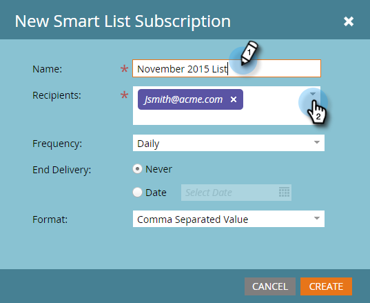

# S’abonner à une Liste dynamique {#subscribe-to-a-smart-list}

L&#39;abonnement à des listes intelligentes est un excellent moyen de suivre les personnes, avec des rapports envoyés directement à votre boîte de réception.

>[!NOTE]
>
>**FYI**
>
>Marketo est maintenant en train de normaliser la langue dans tous les abonnements. Vous pouvez donc voir des pistes dans votre abonnement et des personnes/personnes dans docs.marketo.com. Ces termes signifient la même chose ; cela n&#39;a aucune incidence sur les instructions relatives aux articles. Il y a aussi d&#39;autres changements. [En savoir plus](http://docs.marketo.com/display/DOCS/Updates+to+Marketo+Terminology).

Vous pouvez créer un abonnement de liste intelligent à deux endroits distincts :

* Activités marketing
* Base de données

Les Abonnements utilisent toute la liste des gens au moment où l&#39;abonnement fonctionne.

Les Abonnements vivent là où vit votre liste intelligente, dans les Activités marketing ou la base de données.

Vous pouvez créer plusieurs abonnements à partir de la même liste intelligente.

Les Abonnements sont spécifiques à l’espace de travail. Par exemple, cette liste d’abonnements se trouve dans un espace de travail différent de celui qui est présenté dans le reste de cet article :

>[!NOTE]
>
>Vous êtes limité à 100 abonnements et à un maximum de 100 000 personnes par abonnement, entre espaces de travail, par instance de marché. Si la liste intelligente contient plus de 100 000 noms, Marketo exécutera l’abonnement pour les 100 000 premiers noms.

## Création d’un Abonnement de Liste dynamique {#create-a-smart-list-subscription}

1. Accédez à la **base de données** ou aux **Activités** marketing.

   

1. Sélectionnez la liste intelligente pour laquelle vous souhaitez créer un abonnement. Cliquez sur Actions **de** Liste et sélectionnez** Nouveau Abonnement de Liste dynamique**.

   

1. Donnez un **nom**&#x200B;à votre abonnement, puis sélectionnez ou entrez les adresses électroniques des **Destinataires**.

   

1. Cliquez sur la liste de **fréquence** et sélectionnez une fréquence.

   ** 

   **

1. Définissez la **Diffusion de fin **date. Vous pouvez sélectionner **Jamais** ou une date calendaire.

   

1. Cliquez sur **Format** et faites votre choix dans la liste.

   

1. Cliquez sur **Créer**.

   

1. Votre nouvel abonnement de liste intelligent s’affiche en haut de la liste dans l’onglet Abonnements. Cliquez sur **Envoyer** si vous souhaitez envoyer maintenant et n’attendez pas la diffusion de messagerie planifiée.

   

1. Nous vous recommandons de décocher la case Principale pour désactiver un abonnement de liste dynamique si personne ne s&#39;y abonne.

   

   C&#39;était facile, n&#39;est-ce pas ?

## Message électronique {#email-message}

Les destinataires recevront un courrier électronique avec une option de téléchargement du rapport, ainsi qu’un lien direct vers la liste au sein de l’instance de marché. Le lien de téléchargement expire dans quatre jours.

>[!NOTE]
>
>Si le paramètre [Secure Abonnement Admin](secure-the-subscription-admin-setting.md) est défini sur **Oui**, seules les personnes ayant accès à l’instance de Marketo peuvent télécharger le rapport.

Si un rapport compte 0 personne, les destinataires recevront toujours un courriel. Cependant, le courriel indique simplement qu&#39;il n&#39;y a personne à signaler.

>[!NOTE]
>
>Lorsque vous modifiez un filtre de liste dynamique sur lequel vous avez basé un abonnement, il met également à jour le rapport.

Le courrier électronique fournit également des informations supplémentaires sur les filtres utilisés pour créer la liste.

## Suppression d’un Abonnement {#delete-a-subscription}

Pour supprimer un abonnement, sélectionnez-le dans l’onglet abonnements, puis cliquez sur Supprimer l’Abonnement.

>[!MORELIKETHIS]
>
>* [Modifier un Abonnement de Liste dynamique](edit-a-smart-list-subscription.md)
>* [Sécurisation du paramètre d’administration de l’Abonnement](secure-the-subscription-admin-setting.md)

>

