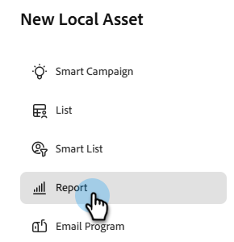
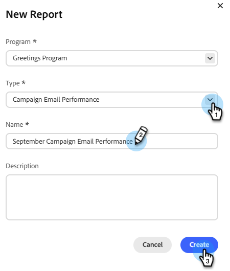

# Rapport des performances des e-mails de campagne {#campaign-email-performance-report}

Pour afficher les statistiques de performances des e-mails regroupées par [Campagne intelligente](/help/marketo/product-docs/core-marketo-concepts/smart-campaigns/creating-a-smart-campaign/understanding-batch-and-trigger-smart-campaigns.md), exécutez un rapport Performances des e-mails de Campaign.

>[!NOTE]
>
>Un rapport de performances des e-mails de campagne ne peut être créé que comme ressource locale dans un programme d’activités marketing. Il n’est pas disponible dans la section Analytics.

1. Dans votre programme, cliquez sur **Nouveau** et sélectionnez **Nouvelle ressource locale**.

   

1. Sélectionnez **Rapport**.

   

1. Dans le menu déroulant _Type_, sélectionnez **Performances des e-mails de Campaign**. Attribuez un nom à votre rapport et cliquez sur **Créer**.

   

1. Définissez les paramètres de votre rapport.

   

1. Lorsque vous avez terminé, cliquez sur l’onglet **Rapport** pour afficher votre rapport.

[Les colonnes que vous pouvez sélectionner](/help/marketo/product-docs/reporting/basic-reporting/editing-reports/select-report-columns.md) pour un rapport Performances des e-mails de Campaign incluent :

| Colonne | Description |
|---|---|
| [!UICONTROL Hard bounce] | L’e-mail a été rejeté en raison d’une condition permanente, telle qu’une adresse e-mail inexistante. |
| [!UICONTROL Soft Bounce] | L’e-mail a été rejeté en raison d’une condition temporaire, telle qu’une panne de serveur ou une boîte de réception pleine. |
| [!UICONTROL En attente] | L’e-mail est toujours en cours de diffusion. |
| [!UICONTROL Lien cliqué] | Nombre de personnes destinataires de l’e-mail qui ont cliqué sur un lien dans l’e-mail. |
| [!UICONTROL Désabonné] | Nombre de destinataires d’e-mails ayant cliqué sur le lien **[!UICONTROL Se désabonner]** dans l’e-mail et rempli le formulaire. |

>[!NOTE]
>
>En général, nous essayons d’utiliser le bon sens pour consigner ces statistiques. Par exemple, si quelqu’un cliquait sur un lien dans un e-mail, il l’ouvrait évidemment en premier. Pour connaître les règles spécifiques que nous suivons, reportez-vous au [Rapport sur les performances des e-mails](/help/marketo/product-docs/email-marketing/email-programs/email-program-data/email-performance-report.md).

>[!MORELIKETHIS]
>
>* [Filtrer Assets dans un rapport de campagne par e-mail](/help/marketo/product-docs/reporting/basic-reporting/report-activity/filter-assets-in-a-campaign-email-reports.md)
>* [&#x200B; Rapport sur les performances des e-mails &#x200B;](/help/marketo/product-docs/email-marketing/email-programs/email-program-data/email-performance-report.md)
