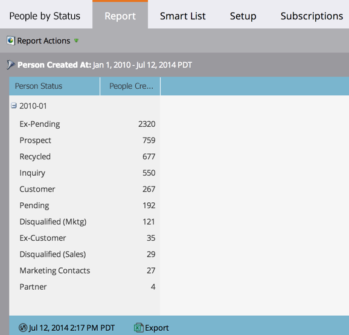

# Rapport des personnes par statut {#people-by-status-report}

Vérifiez à quel point vous faites progresser les personnes tout au long du processus en vérifiant le nombre d’entre elles qui apparaissent chaque mois dans chaque valeur _[!UICONTROL Statut de la personne]_.

1. [Créez un rapport](/help/marketo/product-docs/reporting/basic-reporting/creating-reports/create-a-report-in-a-program.md) puis sélectionnez le **[!UICONTROL Personnes par statut]** [type de rapport](/help/marketo/product-docs/reporting/basic-reporting/report-types/report-type-overview.md).

1. [Définissez la période de votre rapport](/help/marketo/product-docs/reporting/basic-reporting/editing-reports/change-a-report-time-frame.md) puis cliquez sur l’onglet **[!UICONTROL Rapport]**.

1. Fantastique ! Maintenant, vous pouvez voir combien de personnes étaient dans chaque _[!UICONTROL statut de personne]_, de mois en mois.

   

   >[!TIP]
   >
   >Cliquez sur le signe plus (+) pour développer chaque mois et afficher les nombres spécifiques à chaque statut de personne.

   >[!MORELIKETHIS]
   >
   >[Utilisez une liste dynamique pour filtrer votre rapport](/help/marketo/product-docs/reporting/basic-reporting/editing-reports/filter-people-in-a-report-with-a-smart-list.md) pour des personnes spécifiques.
