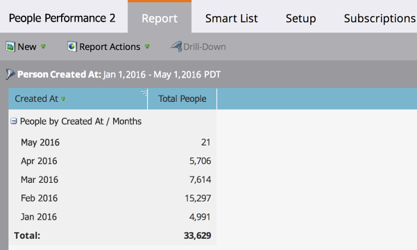

# Rapport de performances des personnes {#people-performance-report}

Utilisez un rapport [!UICONTROL Performances des personnes] pour mesurer la croissance de la base de données au fil du temps. Vous pouvez voir combien de personnes vous avez ajoutées et quand. Apprenez-en plus sur les gens et évaluez vos programmes. Regroupez les résultats par attribut de personne ou d’entreprise, ou par [segmentation](/help/marketo/product-docs/personalization/segmentation-and-snippets/segmentation/create-a-segmentation.md).

1. [Créez un rapport](/help/marketo/product-docs/reporting/basic-reporting/creating-reports/create-a-report-in-a-program.md) puis sélectionnez le **[!UICONTROL Performances des personnes]** [type de rapport](/help/marketo/product-docs/reporting/basic-reporting/report-types/report-type-overview.md).

1. [Définissez la période de votre rapport](/help/marketo/product-docs/reporting/basic-reporting/editing-reports/change-a-report-time-frame.md) puis cliquez sur l’onglet **[!UICONTROL Rapport]**.

1. Fantastique ! Vous êtes maintenant prêt à explorer votre rapport [!UICONTROL  Performances des personnes ]. Découvrez comment en tirer le meilleur parti dans la liste ci-dessous.

   >[!NOTE]
   >
   >Par défaut, les rapports [!UICONTROL Performances des personnes] sont regroupés par mois *[!UICONTROL Date de création]*.

   

## La puissance des rapports de performance des personnes {#the-power-of-people-performance-reports}

Les rapports [!UICONTROL Performances des personnes] sont très puissants. En les regroupant, en les filtrant et en les configurant davantage, vous pouvez en apprendre beaucoup sur les personnes de votre [!UICONTROL Base de données] et sur l’efficacité de vos programmes.

Vous pouvez effectuer les actions suivantes :

* [Regrouper les prospects par attribut de prospect ou d’entreprise](/help/marketo/product-docs/reporting/basic-reporting/report-activity/group-person-reports-by-attribute.md).
* [Regrouper les prospects par segment](/help/marketo/product-docs/personalization/segmentation-and-snippets/segmentation/group-person-reports-by-segment.md).
* [Utilisez les listes dynamiques comme colonnes de rapports personnalisées.](/help/marketo/product-docs/reporting/basic-reporting/editing-reports/add-custom-columns-to-a-person-report.md)
* [Ajoutez des mesures d’opportunité en tant que colonnes de rapport.](/help/marketo/product-docs/reporting/basic-reporting/editing-reports/add-opportunity-columns-to-a-lead-report.md)
* [Analyser en profondeur pour en savoir plus sur les prospects d’une ligne spécifique.](/help/marketo/product-docs/reporting/basic-reporting/report-activity/drill-down-in-a-people-performance-report.md)
* [Filtrer les prospects de votre rapport à l’aide d’une liste dynamique.](/help/marketo/product-docs/reporting/basic-reporting/editing-reports/filter-people-in-a-report-with-a-smart-list.md)
* [Sélectionnez les colonnes à inclure.](/help/marketo/product-docs/reporting/basic-reporting/editing-reports/select-report-columns.md)
* [Triez les colonnes du rapport.](/help/marketo/product-docs/reporting/basic-reporting/editing-reports/sort-report-on-columns.md)

  >[!TIP]
  >
  >N’oubliez pas que les rapports sont faciles à [créer](/help/marketo/product-docs/reporting/basic-reporting/creating-reports/create-a-report-in-a-program.md), configurer et [supprimer](/help/marketo/product-docs/reporting/basic-reporting/report-activity/delete-a-report.md). Allez-y et jouez avec les nombreuses façons de les manipuler, pour apprendre les meilleures façons de se concentrer sur les données clés.
