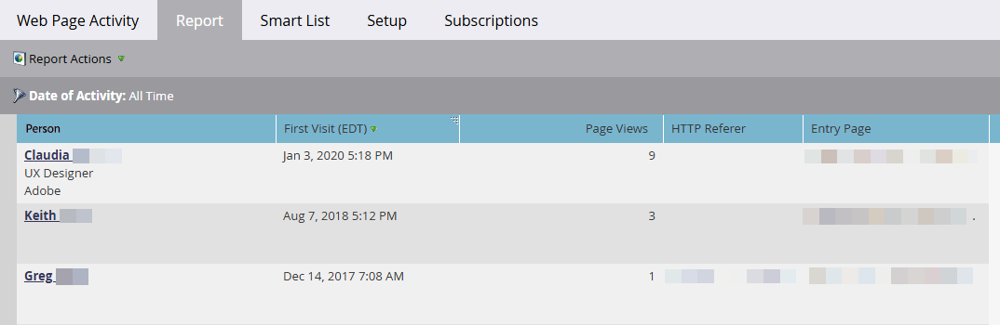

# Rapport d’activité de la page web {#web-page-activity-report}

Dans ce rapport, vous pouvez voir qui visite votre site web et même vous abonner à une version par e-mail du rapport.

Vous pouvez choisir d’afficher des personnes connues ou anonymes, mais pas les deux types sur le même rapport.

>[!PREREQUISITES]
>
>* [Ajout du code de suivi Munchkin à votre site web](/help/marketo/product-docs/administration/additional-integrations/add-munchkin-tracking-code-to-your-website.md){target="_blank"}

1. [Créez un rapport](/help/marketo/product-docs/reporting/basic-reporting/creating-reports/create-a-report-in-a-program.md) puis sélectionnez le **Rapport d’activité de la page web** [type de rapport](/help/marketo/product-docs/reporting/basic-reporting/report-types/report-type-overview.md){target="_blank"}
1. Choisissez d’[afficher les personnes connues ou anonymes](/help/marketo/product-docs/reporting/basic-reporting/report-activity/display-people-or-anonymous-visitors-in-web-reports.md){target="_blank"} dans le rapport.

1. [Définissez la période de votre rapport](/help/marketo/product-docs/reporting/basic-reporting/editing-reports/change-a-report-time-frame.md){target="_blank"} puis cliquez sur l’onglet **Rapport**.

1. Tu l&#39;as ! Consultez votre rapport pour savoir qui visite votre site.

   {width="800" zoomable="yes"}

   >[!NOTE]
   >
   >L’affichage des données dans un rapport [!UICONTROL Activité de page web] peut prendre jusqu’à 24 heures.

   >[!TIP]
   >
   >Pour savoir qui visite le plus votre site, [triez votre rapport](/help/marketo/product-docs/reporting/basic-reporting/editing-reports/sort-report-on-columns.md){target="_blank"} dans la colonne _Pages vues_ et choisissez Trier par ordre décroissant.

   [Marketo ajoute les visiteurs anonymes](/help/marketo/product-docs/reporting/basic-reporting/report-activity/tracking-anonymous-activity-and-people.md){target="_blank"} du site Web à votre base de données et vous pouvez choisir de les afficher dans ce rapport. Il fournit une mine d’informations, même si elles sont anonymes.
   [Les colonnes que vous pouvez sélectionner](/help/marketo/product-docs/reporting/basic-reporting/editing-reports/select-report-columns.md){target="_blank"} pour un rapport d’activité de page web incluent :

<table>
 <thead>
  <tr>
   <th>Colonne(s)</th>
   <th>Description</th>
  </tr>
 </thead>
 <tbody>
  <tr>
   <td>Personne</td>
   <td>Le nom, le titre et la société du visiteur. <strong><a href="/help/marketo/product-docs/reporting/basic-reporting/report-types/web-page-activity-report/web-pages-viewed-web-page-activity-report.md" target="_blank">Cliquez sur</a></strong> pour afficher les pages visitées.</td>
  </tr>
  <tr>
   <td>Première/Dernière Visite (Fuseau Horaire)</td>
   <td>Date et heure de la première/dernière visite d'un membre de cette société.</td>
  </tr>
  <tr>
   <td>Pages vues</td>
   <td>Nombre de pages chargées par ce visiteur.</td>
  </tr>
  <tr>
   <td>Référant HTTP</td>
   <td>URL de la page contenant le lien que le visiteur a suivi vers votre page.</td>
  </tr>
  <tr>
   <td>Page d'accueil</td>
   <td>Première page visitée par la personne </td>
  </tr>
  <tr>
   <td>Société ou fournisseur d'accès Internet inférés</td>
   <td>La société, comme déduit de l’adresse IP des visiteurs. <strong>Les noms en gras</strong> indiquent qu’il s’agit de la société, et non du FAI. </td>
  </tr>
  <tr>
   <td>Pays, État/région et ville déduits</td>
   <td>Emplacement géographique du visiteur, tel qu’déduit de son adresse IP.</td>
  </tr>
 </tbody>
</table>

>[!TIP]
>
>Ravissez vos commerciaux ! [Filtrez le rapport](/help/marketo/product-docs/reporting/basic-reporting/editing-reports/filter-people-in-a-report-with-a-smart-list.md){target="_blank"} pour leur territoire et [abonnez-vous](/help/marketo/product-docs/reporting/basic-reporting/report-subscriptions/subscribe-to-a-basic-report.md){target="_blank"} !

>[!MORELIKETHIS]
>
>* [Pages Web vues, Rapport d’activité de la page Web](/help/marketo/product-docs/reporting/basic-reporting/report-types/web-page-activity-report/web-pages-viewed-web-page-activity-report.md){target="_blank"}
>* [Afficher des personnes ou des visiteurs anonymes dans des rapports web](/help/marketo/product-docs/reporting/basic-reporting/report-activity/display-people-or-anonymous-visitors-in-web-reports.md){target="_blank"}
