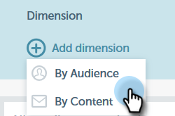

# Dimensions personnalisées pour les informations sur les courriers électroniques {#custom-dimensions-for-email-insights}

Toutes les dimensions Marketo standard sont incluses, mais vous pouvez ajouter jusqu’à 10 dimensions personnalisées. Les dimensions personnalisées se composent de segments et de balises de programme. Voici comment les ajouter.

>[!NOTE]
>
>**Autorisations d’administrateur requises**

>[!CAUTION]
>
>Les dimensions personnalisées **ne peuvent pas** être supprimées ou remplacées. Choisissez donc soigneusement vos 10 dimensions personnalisées.

1. Dans Email Insights, cliquez sur l’icône d’engrenage dans le coin supérieur droit de la page.

   

1. Cliquez sur **Système**.

   

1. Cliquez sur **+** en regard de **Ajouter une dimension**.

   

1. Commencez la sélection !

   

   >[!NOTE]
   >
   >**Par audience** : affiche toutes les segments approuvés (depuis la base de données)
   >
   >**Par contenu** : affiche toutes les balises de programme
