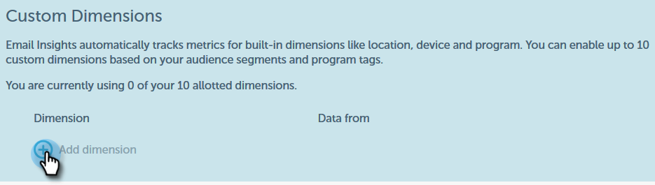

# Dimensions personnalisées pour Email Insights {#custom-dimensions-for-email-insights}

Toutes les dimensions Marketo standard sont incluses, mais vous avez la possibilité d’ajouter jusqu’à 10 dimensions personnalisées. Les dimensions personnalisées se composent de segmentations et de balises de programme. Voici comment les ajouter.

>[!NOTE]
>
>**Autorisations d’administration requises**

>[!CAUTION]
>
>Les dimensions personnalisées **ne peuvent pas** être supprimées ou remplacées. Choisissez donc soigneusement vos 10 dimensions.

1. Dans [!UICONTROL Insights sur les e-mails], cliquez sur l’icône en forme d’engrenage en haut à droite de la page.

   

1. Cliquez sur **[!UICONTROL Système]**.

   

1. Cliquez sur le **+** en regard de **[!UICONTROL Ajouter une dimension]**.

   

1. Commencez la sélection !

   

   >[!NOTE]
   >
   >**[!UICONTROL Par audience]** : affiche toutes les segmentations approuvées (depuis la base de données)
   >
   >**[!UICONTROL Par contenu]** : affiche toutes les balises de programme
