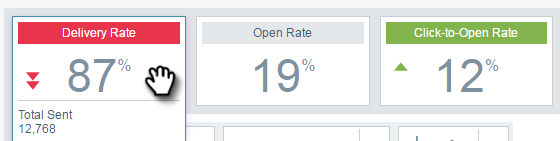

# Présentation d’Email Insights Analytics {#email-insights-analytics-overview}

Dans [!UICONTROL Analytics], explorez les données agrégées pour la diffusion et l’engagement des e-mails. Utilisez le graphique à gauche pour explorer les données, les informations à droite pour une expérience plus guidée.

Le [Filtrage](/help/marketo/product-docs/reporting/email-insights/filtering-in-email-insights.md) est disponible pour vous aider à rechercher des mesures spécifiques.

Les mosaïques Points ciblés (KPI) vous donnent un aperçu des mesures les plus populaires.

Pointez sur les mosaïques d’indicateurs de performance clés pour plus de détails...

...ou afficher les détails sans avoir à pointer en élargissant la fenêtre du navigateur (sur des écrans plus grands).

>[!TIP]
>
>Ces couleurs veulent dire quelque chose ! Le vert indique un bon changement, le rouge un mauvais changement, le gris un rien qui a changé. Ceci est basé sur la période de comparaison que vous avez choisie dans le filtrage.

Le graphique affiche vos critères filtrés. Pour masquer l&#39;un de vos filtres, cliquez simplement sur sa barre de couleurs...

...et la mesure disparaît du graphique. Cliquez à nouveau sur la barre de couleurs pour la faire réapparaître.

Si vous créez un graphique que vous souhaitez réutiliser, faites-en un [graphique rapide](/help/marketo/product-docs/reporting/email-insights/email-insights-quick-charts.md).

Sur le côté droit de la page, les mesures guidées vous aident à découvrir les pilotes pertinents. Cliquez sur une mesure pour l’afficher dans le graphique sur le côté gauche de la page.

>[!NOTE]
>
>Vous voyez cette [!UICONTROL Actualiser] en haut à droite ? Lorsque vous le verrez, vous devrez cliquer manuellement dessus pour actualiser le module Insights. Nous ne l’affichons que lorsque vous avez apporté une modification aux filtres qui invaliderait les valeurs actuelles.

Vous pouvez également spécifier ce que vous voyez (de gauche à droite) : Tous, Audience, Contenu et Plateforme.

>[!MORELIKETHIS]
>
>[Présentation des envois d’informations sur les e-mails](/help/marketo/product-docs/reporting/email-insights/email-insights-sends-overview.md)
