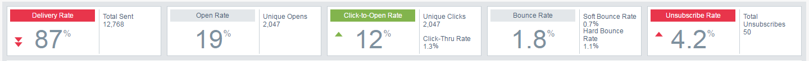

# Présentation des analyses des statistiques par courriel {#email-insights-analytics-overview}

Dans Analytics, explorez les données d’agrégat pour la diffusion et l’engagement des courriels. Utilisez le graphique à gauche pour explorer les données, les informations à droite pour une expérience plus guidée.

[Le ](filtering-in-email-insights.md) filtrage est disponible pour vous aider à affiner l’analyse de mesures spécifiques.

Les mosaïques Points ciblés clés (IPC) vous donnent un aperçu rapide des mesures les plus populaires.

Passez la souris sur les mosaïques des indicateurs de performance clés pour plus de détails...

`   
`

...ou afficher les détails sans avoir à pointer en développant la fenêtre de votre navigateur (sur des écrans plus grands).

` 

`

>[!TIP]
>
>Ces couleurs ont un sens ! Le vert indique un bon changement, le rouge signifie un mauvais changement, le gris signifie que rien n&#39;a changé. Il est basé sur la période de comparaison que vous avez choisie pour le filtrage.

Le graphique affiche vos critères filtrés. Pour masquer un de vos filtres, il vous suffit de cliquer sur sa barre de couleurs...

`   
`

...et la mesure disparaît du graphique. Cliquez de nouveau sur la barre de couleurs pour la faire réapparaître.

`   
`

Si vous créez un graphique que vous souhaitez réutiliser, définissez-le comme [graphique rapide](email-insights-quick-charts.md).

`   
`

Sur le côté droit de la page, les mesures guidées vous aident à découvrir les pilotes appropriés. Cliquez sur une mesure pour l’afficher dans le graphique sur le côté gauche de la page.

>[!NOTE]
>
>Vous voyez que Actualiser en haut à droite ? Lorsque vous le verrez, vous devrez cliquer manuellement dessus pour actualiser le module Insights. Nous ne l&#39;affichons que lorsque vous avez apporté une modification aux filtres qui invaliderait les valeurs actuelles.

`  
You can also specify what you see (left to right): All, Audience, Content, and Platform.  
`  `   
`

>[!MORELIKETHIS]
>
>[Présentation des informations sur les e-mails envoyés](email-insights-sends-overview.md)

