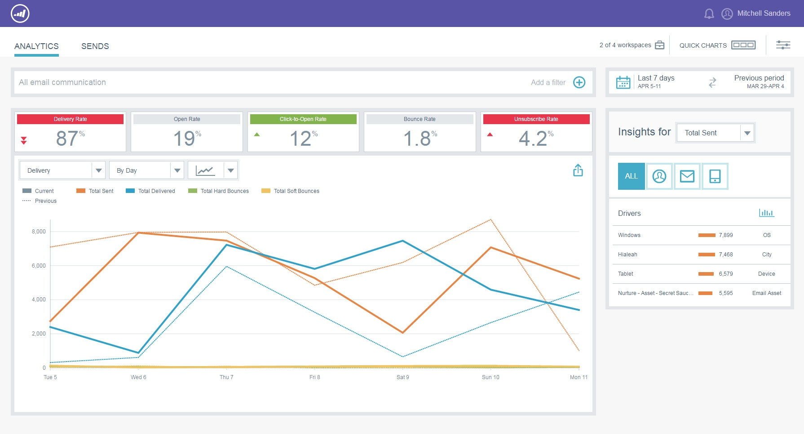

# Présentation des statistiques sur les emails {#email-insights-overview}

Email Insights fournit des informations puissantes à partir de données historiques pour les spécialistes du marketing par e-mail. Il se compose de deux sections distinctes mais associées : Analytics et Envois.

Pour accéder à la fonction Statistiques sur les e-mails, cliquez simplement sur sa mosaïque dans Mon Marketo (ou sur l’écran d’accueil d’Analytics).

>[!NOTE]
>
>Par défaut, vous verrez les données de chaque espace de travail auquel vous avez accès. Vous pouvez désélectionner les espaces de travail que vous ne souhaitez pas afficher. Votre ou vos sélections seront mémorisées à l’avenir.

## Analytics {#analytics}

Utilisez [Analytics](/help/marketo/product-docs/reporting/email-insights/email-insights-analytics-overview.md) pour explorer les données agrégées de série temporelle pour la diffusion des emails et les mesures d’engagement.

**Filtres**

Utilisé des [filtres](/help/marketo/product-docs/reporting/email-insights/filtering-in-email-insights.md) avancés pour ventiler les résultats par audience, contenu ou plateforme. Les mêmes filtres s’appliquent à Analytics et aux envois.

**Graphiques rapides**

Les [ tableaux rapides ](/help/marketo/product-docs/reporting/email-insights/email-insights-quick-charts.md) sont des miniatures que vous créez et enregistrez, ce qui vous permet d’afficher rapidement les graphiques importants pour vous.

## Envois {#sends}

Sur la page [Envois](/help/marketo/product-docs/reporting/email-insights/email-insights-sends-overview.md) , examinez les caractéristiques des communications par e-mail récentes.

**Mesures**

Cliquez sur les barres Mesures pour traduire les couleurs en nombres.

>[!NOTE]
>
>Les données peuvent prendre jusqu’à 8 heures pour être reflétées dans les statistiques sur les emails.

## Dimensions personnalisées {#custom-dimensions}

Toutes les dimensions Marketo standard sont incluses, mais vous pouvez ajouter jusqu’à 10 dimensions personnalisées. [Les dimensions personnalisées](/help/marketo/product-docs/reporting/email-insights/custom-dimensions-for-email-insights.md) se composent de segments et de balises de programme.

>[!MORELIKETHIS]
>
>* [Présentation de l’analyse des statistiques sur les e-mails](/help/marketo/product-docs/reporting/email-insights/email-insights-analytics-overview.md)
>* [Présentation des envois de statistiques d’email](/help/marketo/product-docs/reporting/email-insights/email-insights-sends-overview.md)
