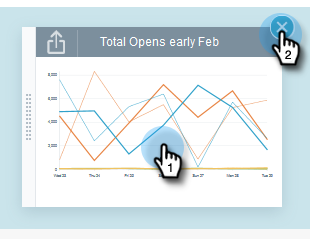

# Graphiques rapides d’informations sur les e-mails {#email-insights-quick-charts}

Les graphiques rapides sont des miniatures que vous personnalisez et enregistrez pour obtenir un aperçu rapide des graphiques que vous utilisez le plus.

## Créer un graphique rapide {#create-a-new-quick-chart}

Dans cet exemple, nous choisirons un taux d’ouverture pour les trois premières semaines de février 2016 dans les États de Californie et de Floride.

1. Cliquez sur le filtre de date à droite de l’écran [!UICONTROL Analytics].

   

1. Choisissez la période souhaitée.

   

1. Lorsque votre période est sélectionnée, cliquez sur **[!UICONTROL Appliquer]**.

   

1. Le graphique change après l’application des dates.

   

1. Cliquez sur la première liste déroulante. Cliquez pour sélectionner vos critères (s’ils ne sont pas déjà sélectionnés) et désélectionnez tous les critères indésirables.

   

1. Sur le côté droit du graphique, cliquez sur l’icône d’exportation et sélectionnez **[!UICONTROL Enregistrer en tant que graphique rapide]**.

   

1. Nommez votre graphique rapide et cliquez sur **[!UICONTROL Enregistrer]**.

   

   >[!NOTE]
   >
   >Vous pouvez avoir jusqu&#39;à 20 graphiques rapides. Ils peuvent être supprimés et remplacés.

1. Votre nouveau graphique rapide apparaîtra avec les autres.

   

   Et c&#39;est tout !

   >[!TIP]
   >
   >Pour déplacer un graphique rapide, il vous suffit de cliquer dessus et de le faire glisser à l’emplacement souhaité.

## Supprimer un graphique rapide {#delete-a-quick-chart}

Vous souhaitez supprimer l&#39;un de vos graphiques rapides ? C&#39;est facile !

1. Cliquez sur l’icône **[!UICONTROL Graphiques rapides]**.

   

1. Pointez sur le graphique souhaité, mais ne cliquez pas dessus. Au survol, un X s’affiche. Cliquez sur le **X**.

   

1. Cliquez sur **[!UICONTROL OK]**.

   

   Votre graphique rapide est maintenant supprimé. Je t&#39;ai dit que c&#39;était facile.
