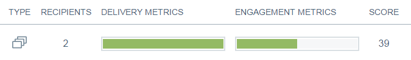

# Vue d’ensemble des envois Email Insights {#email-insights-sends-overview}

Sur la page [!UICONTROL Envois], examinez les caractéristiques d’une communication par e-mail récente.

Utilisez [filtrage](/help/marketo/product-docs/reporting/email-insights/filtering-in-email-insights.md) pour spécifier les e-mails à afficher.

Sur le côté droit de la page se trouvent plusieurs informations concernant les e-mails que vous avez envoyés.

**[!UICONTROL Type]** indique le type de ressource utilisé.
Le nombre de **[!UICONTROL destinataires]** correspond au nombre de personnes auxquelles l’e-mail a été envoyé.
Le tableau **[!UICONTROL Mesures de diffusion]** vous donne un aperçu rapide du nombre d’e-mails diffusés, en attente ou ayant fait l’objet d’un rebond.
**[!UICONTROL Mesures d’engagement]** vous donne un aperçu rapide du nombre de destinataires qui ont ouvert un e-mail, y ont cliqué et s’en sont désabonnés.
**[!UICONTROL Score]** est le [score d’engagement](/help/marketo/product-docs/email-marketing/drip-nurturing/reports-and-notifications/understanding-the-engagement-score.md) de votre e-mail.

Par défaut, vos e-mails sont triés selon la mesure la plus récente, mais vous pouvez les trier selon n’importe quelle mesure disponible.

>[!NOTE]
>
>Les e-mails sont répertoriés par nom de programme ou de campagne (en haut) et par nom de ressource d’e-mail (en bas).

Si vous souhaitez afficher les statistiques de vos e-mails dans Analytics, passez la souris en regard de Notation et cliquez sur l’icône de graphique.

Des trucs sympas !

>[!MORELIKETHIS]
>
>[Présentation d’Email Insights Analytics](/help/marketo/product-docs/reporting/email-insights/email-insights-analytics-overview.md)
