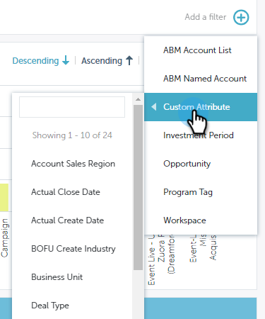

# Filtrage dans [!UICONTROL Performances Insights] {#filtering-in-performance-insights}

Filtrez facilement les données pour interroger des informations spécifiques.

Cliquez sur le signe + pour commencer à ajouter des filtres.

>[!NOTE]
>
>Actuellement, les attributs personnalisés sont disponibles dans les filtres uniquement pour les clients pour lesquels Revenue Cycle Analytics est activé.

Cliquez sur une catégorie pour afficher plusieurs sous-catégories.

Choisissez une sous-catégorie et recherchez/sélectionnez une valeur.

Les graphiques sont mis à jour pour refléter le ou les filtres sélectionnés.

Vous pouvez ajouter des filtres supplémentaires en suivant les mêmes étapes.

Vous pouvez supprimer un filtre à tout moment en cliquant sur le X adjacent. Supprimez tous les filtres en une seule fois en cliquant sur le X tout à droite.

## Filtres disponibles {#available-filters}

<table>
 <tbody>
  <tr>
   <td colspan="1"><strong>Liste de comptes ABM</strong></td>
   <td colspan="1">Si vous utilisez Marketo ABM, toutes vos listes de comptes seront synchronisées avec MPI et visibles via le filtre « Liste de comptes ABM ». Vous pouvez sélectionner une liste de comptes pour filtrer les résultats sur ces comptes.<a href="https://docs.marketo.com/display/public/DOCS/Account-Based+Web+Marketing+with+ABM" rel="nofollow">En savoir plus sur les listes de comptes ABM.</a></td>
  </tr>
  <tr>
   <td colspan="1"><strong>Compte nommé ABM</strong></td>
   <td colspan="1">Si vous utilisez Marketo ABM, tous vos comptes nommés seront synchronisés avec MPI et seront visibles via le filtre « Compte nommé ABM ». Vous pouvez sélectionner un compte nommé pour filtrer les résultats sur ces comptes.<a href="https://docs.marketo.com/x/eaCt" rel="nofollow">En savoir plus sur les comptes nommés ABM.</a></td>
  </tr>
  <tr>
   <td colspan="1"><strong>Attribut personnalisé</strong></td>
   <td colspan="1">
C'est vous qui les déterminez. Tous les champs <a href="/help/marketo/product-docs/reporting/revenue-cycle-analytics/revenue-tools/enabling-custom-field-sync-for-revenue-cycle-analytics.md" rel="nofollow">que vous activez</a> pour l’analyse des opportunités peuvent être filtrés dans les informations sur les performances.
</td>
  </tr>
  <tr>
   <td colspan="1">
<strong>Période d’investissement</strong>
</td>
   <td colspan="1">
Échéancier des coûts du programme.
</td>
  </tr>
  <tr>
   <td colspan="1">
<strong>Opportunité</strong>
</td>
   <td colspan="1">
Type d’opportunité tel que configuré sur l’objet d’opportunité dans votre configuration Salesforce (CRM).
</td>
  </tr>
  <tr>
   <td>
<strong>Étiquette de programme</strong>
</td>
   <td>
Les balises sont utilisées pour décrire les programmes. Vous pouvez en faire autant que nécessaire, chacun avec des valeurs uniques. <a href="/help/marketo/product-docs/administration/tags/create-a-new-program-tag-and-tag-values.md" rel="nofollow">Découvrez comment utiliser les balises de programme ici.</a>
</td>
  </tr>
  <tr>
   <td><strong>Espace de travail</strong></td>
   <td>
Les espaces de travail sont des zones distinctes de Marketo qui contiennent des ressources marketing, telles que : des programmes, des pages de destination, des e-mails, etc. <a href="/help/marketo/product-docs/administration/workspaces-and-person-partitions/understanding-workspaces-and-person-partitions.md" rel="nofollow">En savoir plus sur les espaces de travail ici.</a>
</td>
  </tr>
 </tbody>
</table>

>[!NOTE]
>
>Dans le tableau de bord [!UICONTROL Engagement], seules les balises de programme et les filtres d’espace de travail sont disponibles.
