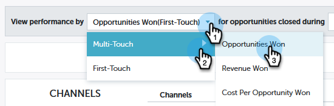

# Présentation de la contribution des informations sur les performances {#performance-insights-contribution-overview}

Dans Marketo Performance Insights, la vue Contribution s’affiche par défaut.

Sélectionnez la mesure en fonction de laquelle vous souhaitez afficher les performances. Dans cet exemple, nous allons examiner les opportunités gagnées via l’option Multi-Touch dans le tableau de bord Recettes.

>[!NOTE]
>
>Découvrez [Première touche et Multi-touche](/help/marketo/product-docs/reporting/revenue-cycle-analytics/revenue-tools/attribution/understanding-attribution.md).

Sélectionnez la période pour laquelle vous souhaitez afficher les mesures. Dans cet exemple, nous examinons l’année en cours (année à jour).

>[!NOTE]
>
>Nous avons temporairement supprimé la sélection &quot;Année précédente&quot;. Vous avez toujours la possibilité d’afficher l’ensemble des données de performances de l’année précédente à l’aide de la sélection Plage personnalisée .

Les mesures sont présentées sous la forme de deux graphiques : en beignet et en barres.

Le graphique en anneau présente les dix premiers canaux de la mesure que vous avez sélectionnée.

Le graphique à barres affiche les performances du programme sur tous les canaux (dix programmes à la fois) pour la mesure que vous avez sélectionnée. Pour afficher plus d’informations, cliquez sur la flèche située à droite pour faire défiler l’écran jusqu’au groupe suivant.

>[!TIP]
>
>Si vous souhaitez que les barres du graphique s’ajustent à mesure que vous faites défiler les groupes, cochez la case **Ajuster l’axe Y à l’échelle** .

Pointez sur une barre pour afficher des détails supplémentaires.

Sélectionnez un ou plusieurs canaux dans le diagramme en anneau et tous les programmes associés à ces canaux apparaissent dans le graphique à barres à droite. Cliquez à nouveau sur le ou les canaux à désélectionner.

La grille de données ci-dessous fonctionne comme une feuille de calcul, affichant toutes les mesures disponibles sous le modèle d’attribution sélectionné (Première touche/Multi-touche). La colonne contenant la mesure choisie est mise en surbrillance.

| **Opportunités remportées** | La partie du crédit (en valeur numérique) que le programme a reçue pour avoir influencé l’opportunité gagnée |
|---|---|
| **Recettes remportées** | La part du crédit (en valeur monétaire) reçue par le programme pour avoir influencé l’opportunité gagnée |
| **Cost** | Coût total du programme |
| **Coût par opportunité Won** | Le ratio du coût du programme et la part du crédit (en valeur numérique) que le programme a reçue pour influer sur la création de nouvelles opportunités |
| **Recettes Gérées Par Rapport Aux Coûts** | Le ratio de la part du crédit (en valeur monétaire) reçue par le programme pour influencer les opportunités gagnées et le coût du programme |

Développez un canal pour afficher ses dix premiers programmes, les autres étant combinés.

>[!NOTE]
>
>Cliquez sur la case à cocher en regard d’un canal pour l’activer/la désactiver dans le diagramme en anneau ci-dessus.
