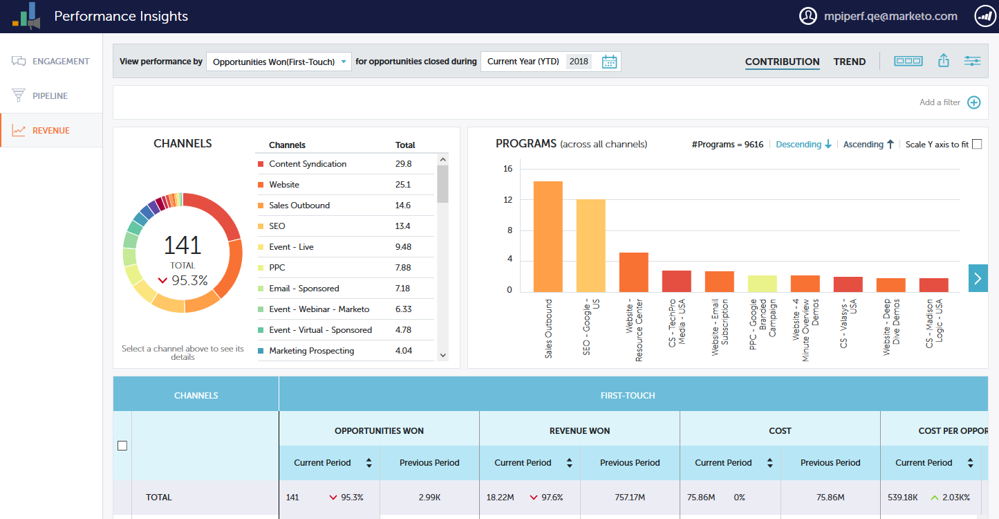

# Tableaux de bord Performance Insights {#performance-insights-dashboards}

En savoir plus sur les tableaux de bord disponibles dans MPI.

## Engagement {#engagement}

Le tableau de bord d’engagement vous aide à mesurer l’efficacité de vos programmes d’acquisition de nouveaux noms et de votre culture.

Mesure de l&#39;engagement des Audiences

Sélectionnez la mesure **Réussites** pour mesurer l’engagement des audiences dans vos programmes de culture. Le succès est une mesure de l&#39;interaction significative dans Marketo.

Le but d&#39;un programme est de créer une interaction significative avec la personne ou la prospect. Le succès est marqué lorsqu’une personne atteint l’état qui lui permet d’atteindre cet objectif. Il peut s’agir de participer à un webinaire, de cliquer sur un lien dans un courriel ou de remplir un formulaire Web. Le succès varie en fonction du canal du programme.

>[!NOTE]
>
>**Exemple**
>
>Dans un programme de webinaire, il peut y avoir plusieurs états, tels que : Invité, enregistré et assisté. Invité ou Inscrit ne sont pas des interactions significatives parce que les gens ne regardent pas vraiment le webinaire. Participé est considéré comme un succès dans ce cas.

Mesurer l&#39;acquisition de nouveaux noms

Choisissez la mesure **Nouveaux noms** pour mesurer l’efficacité de vos nouveaux programmes d’acquisition de noms.

>[!NOTE]
>
>Tous vos programmes doivent être configurés pour définir le programme d&#39;acquisition et la date d&#39;acquisition des pistes afin que ce tableau de bord vous donne les meilleurs résultats.

## Pipeline {#pipeline}

Le tableau de bord de pipeline présente les performances des canaux par mesures Première touche et multipoint.

<table> 
 <tbody> 
  <tr> 
   <td>
<strong>Nouvelles opportunités</strong>
</td> 
   <td>
Partie du crédit que le programme a reçu pour avoir influencé la création de nouvelles possibilités. Il peut s'agir d'une fraction si plusieurs pistes sont impliquées.
</td> 
  </tr> 
  <tr> 
   <td>
<strong>Pipeline créé</strong>
</td> 
   <td>
Partie du crédit (en valeur monétaire) que le programme a reçue pour avoir influencé la création d'opportunités. Il peut s'agir d'une fraction du total si plusieurs pistes sont impliquées.
</td> 
  </tr> 
  <tr> 
   <td>
<strong>Ouverture du tuyau</strong>
</td> 
   <td>
Partie du crédit (en valeur monétaire) que le programme a reçue pour avoir influencé la création d'opportunités qui sont encore ouvertes. Il peut s'agir d'une fraction du total si plusieurs pistes sont impliquées.
</td> 
  </tr> 
  <tr> 
   <td>
<strong>Recettes attendues</strong>
</td> 
   <td>
Partie du crédit (en valeur monétaire) que le programme a reçue pour avoir influencé la création d'opportunités. Recettes prévues est la probabilité d'opportunité multipliée par la valeur d'opportunité. Il peut s'agir d'une fraction si plusieurs pistes sont impliquées.
</td> 
  </tr> 
  <tr> 
   <td>
<strong>Coût par opportunité créé</strong>
</td> 
   <td>
Part du coût du programme qui a influencé les nouvelles possibilités divisée par le nombre total de nouvelles possibilités créées.
</td> 
  </tr> 
  <tr> 
   <td>
<strong>Pipeline créé par rapport au ratio de coûts</strong>
</td> 
   <td>
Partie du crédit qu'un programme a reçu pour avoir influencé la création de nouvelles possibilités, divisée par la partie du coût du programme qui a influé sur la création de possibilités.
</td> 
  </tr> 
 </tbody> 
</table>

## Recettes {#revenue}

Le tableau de bord des recettes affiche les performances des canaux par mesures Première touche et multipoint.

<table> 
 <tbody> 
  <tr> 
   <td>
<strong>Opportunités gagnées</strong>
</td> 
   <td>
Partie du crédit qu'un programme a reçu pour avoir influencé une opportunité gagnée.
</td> 
  </tr> 
  <tr> 
   <td>
<strong>Recettes gagnées</strong>
</td> 
   <td>
La part du crédit (en valeur monétaire) reçue pour avoir influencé une opportunité gagnée.
</td> 
  </tr> 
  <tr> 
   <td>
<strong>Coût par opportunité gagné</strong>
</td> 
   <td>
Part du coût du programme qui a influencé les nouvelles possibilités divisée par le nombre total de nouvelles possibilités créées.
</td> 
  </tr> 
  <tr> 
   <td>
<strong>Rapport entre les recettes et les coûts</strong>
</td> 
   <td>
La part du crédit (en valeur monétaire) reçue pour avoir influencé une opportunité gagnée, divisée par la part du coût du programme qui a influencé de nouvelles opportunités.
</td> 
  </tr> 
 </tbody> 
</table>

