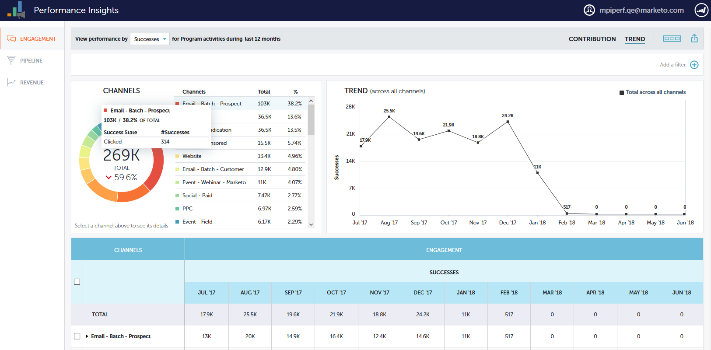
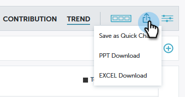

# [!UICONTROL Performances Insights] Aperçu {#performance-insights-overview}

Marketo [!UICONTROL Performance Insights] vous aide à optimiser votre mix de canaux pour une efficacité maximale, ainsi qu’à découvrir des tendances à long terme pour repérer des stratégies gagnantes cohérentes.

>[!AVAILABILITY]
>
>Tout le monde n’a pas acheté cette fonctionnalité. Pour plus d’informations, contactez l’équipe du compte Adobe (votre gestionnaire de compte).

[!UICONTROL Performance Insights] charge les données des (jusqu’à) 24 mois précédents. Cela inclut les données cumulatives de l&#39;année en cours, ainsi que celles de l&#39;année précédente. Ainsi, par exemple, le 31 janvier 2019 , MPI chargera les données de ce mois-là, et tous les mois à partir de 2018. Le 31 décembre 2019, MPI chargera les données de chaque mois de 2019 et 2018.

Pour accéder à [!UICONTROL Performances Insights], cliquez sur son icône sur l’écran d’accueil d’Analytics.

## Contribution {#contribution}

Évaluez la contribution [contribution au chiffre d&#39;affaires](/help/marketo/product-docs/reporting/performance-insights/performance-insights-contribution-overview.md) du marketing en fonction de l&#39;acquisition, de l&#39;influence et de la conversion des clients, voire de la croissance de la base installée.

Par défaut, les données affichées reflètent les performances par [!UICONTROL engagement]. Vous pouvez passer aux performances en **[!UICONTROL Pipeline]** ou **[!UICONTROL Chiffre d’affaires]** simplement en cliquant sur l’un d’eux.

## Tendance {#trend}

Découvrez [&#x200B; tendances à long terme &#x200B;](/help/marketo/product-docs/reporting/performance-insights/performance-insights-trend-overview.md) repérer des stratégies gagnantes cohérentes.

## Paramètres {#settings}

Dans les tableaux de bord [!UICONTROL Revenu] et [!UICONTROL Pipeline], cliquez sur l’icône [[!UICONTROL Paramètres]](/help/marketo/product-docs/reporting/performance-insights/performance-insights-settings.md) pour définir des paramètres supplémentaires.

## Exporter des données {#export-data}

Vous pouvez exporter les données et les graphiques au format [!DNL PowerPoint] ou [!DNL Excel]. Vous pouvez également les enregistrer en tant que [graphique rapide](/help/marketo/product-docs/reporting/performance-insights/performance-insights-quick-charts.md).

>[!NOTE]
>
>Exportez des données vers [!DNL Excel] pour afficher les données disponibles pour tous les canaux (et pas seulement les dix premiers). L’exportation PPT sera WYSIWYG (la sortie imitera ce que vous voyez à l’écran).
